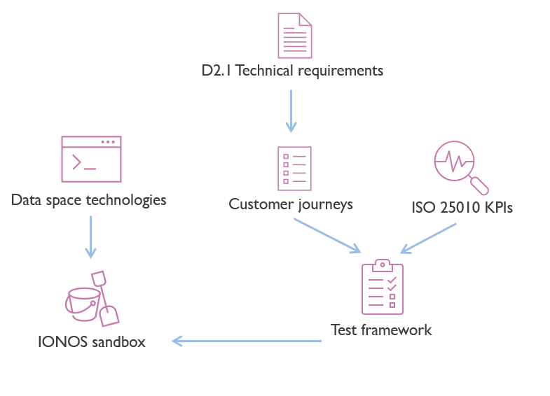

deployEMDS
========
### deployEMDS empowers interoperable, trustworthy and accessible data sharing

[deployEMDS](https://deployemds.eu/) is a project co-funded under the [EU Digital Europe Programme](https://digital-strategy.ec.europa.eu/en/activities/digital-programme) and responds to its outlined challenges. The project will help make the common European mobility data space a reality.  The initiative will cultivate a broad European ecosystem of data providers and users, facilitating the adoption of common building blocks. 16 use cases from nine EU countries will contribute to the development of innovative services and applications.

The European mobility data space (EMDS) will offer a framework for interlinking and federating ecosystems. deployEMDS supports the EMDS initiative through:
* **Data interoperability:** Sharing and exchaging data in a standardised way
* **Data sovereignty and trust:** Retaining authority and control over data
* **Accessibility:** Discoverability and availability of mobility data

The project supports real-life implementations in nine cities and regions: 
* Barcelona (ES)
* Île-de-France (FR)
* Milan (IT)
* Lisbon (PT)
* Flanders (BE)
* Sofia (BG)
* Stockholm (SE)
* Tampere (FI)
* Budapest (HU).

These initiatives focus on the development of innovative services and applications in urban mobility, while assisting in policymaking through the sharing and reuse of data.

The repository
==============
The **deployEMDS** repository is the reference container of a thorough assessment of multiple data space technology stacks, more in detail:

* The technical implementations of the `test facilities`_(see infra)_
* The test environment, where reference data sources, data schemas, vocabularies, and usage control policies are shared across all tests.
* The tests and assessments, these are linked to the data space participants' customer journeys covering the essential data space capabilities.

A `test facility` is an environment where a pre-defined technology stack is tested. There might be more test facilities based on the same core technologies but using different capabilities, if this would affect the tests.
For instance: EDC using verifiable credentials, EDC using iShare, Fiware, ...

Each test facility develops tests adapted to the data space's technology. The test definitions are data space stack-agnostic, while the test implementations are specific to the facility. Tests must produce the same expected outcome, but no assumption is made on approaches and technology.

The workflow
============
A **sandbox environment** is provided by IONOS to deploy data space stacks. SaaS providers must make sure that their services are accessible from this environment.

A **data space stack** is the combination of technical building blocks, and it might span over more than one framework (e.g., EDC + iShare). The choice of the stack is delegated to the EMDS Building Block Working Group. The deployment of the stack should result in a mock data space. 

The **testing facility** is the composition of infrastructure, data space stack, and test squad (team). We define one stack per test facility, and the mock data space should be consistent for each testing facility. They should have: 
- The same participants and their identities.
- The same data product(s) being shared.
- The same usage policies.
- The same data planes.
- The same root taxonomies and vocabularies describing the data product(s).
- The same certificate authority.

The testing facilities will use a phased or agile approach,  where in each phase specific components are deployed and tested. 
The progress of each testing facility will be tracked by use of reporting tools, _in casu_ the [GitHub issues](https://github.com/imec-int/deployEMDS/issues) of this repository.

Planning
========
The deployEMDS testing is planned to be executed in three phases:
 1. **Phase 1**: 2024-07-01 - 2024-07-19
     1. _[Minimal](https://github.com/imec-int/deployEMDS/issues?q=is%3Aopen+is%3Aissue+milestone%3A%22Phase+1%22+label%3Aminimal)_: The minimal set of tests to be executed in each testing facility.
     2. _[Extended](https://github.com/imec-int/deployEMDS/issues?q=is%3Aopen+is%3Aissue+milestone%3A%22Phase+1%22+-label%3Aminimal)_: The extended set of tests to be executed in each testing facility, should time allow.
 2. **Phase 2**: 2024-07-22 - 2024-08-09
     * _Minimal_: The minimal set of tests to be executed in each testing facility.
     * _Extended_: The extended set of tests to be executed in each testing facility, should time allow.

Testing facilities
==================

The following testing facilities are currently proposed:

| Facility Name     | Stack                                | Components available                                   | Technical buddy                        | Test squad 1 | Test squad 2                  | Status                                                                                                                                            
|-------------------|--------------------------------------|--------------------------------------------------------|----------------------------------------|--------------|-------------------------------|---------------------------------------------------------------------------------------------------------------------------------------------------|
| EDC+VC            | EDC v0.7 with Verifiable Credentials | TBD                                                    |                           | imec         | i2cat (ph 1), NTTDATA (ph 2)  | [Ready to start](https://github.com/imec-int/deployEMDS/issues?q=is%3Aopen+is%3Aissue+milestone%3A%22Phase+1%22+label%3Aedc%2Bvc+label%3Aminimal) |
| Fiware            | Fiware with Verifiable Credentials   | TBD                                                    | Gernot (Fiware)                        | Fraunhofer   | Cefriel                       | [Ready to start](https://github.com/imec-int/deployEMDS/issues?q=is%3Aopen+is%3Aissue+milestone%3A%22Phase+1%22+label%3Afiware+label%3Aminimal+)  |
| Pontus-X | Gaia-X compliant decentralized data economy toolbox | TBD | TBD | TBD | TBD | Interview had, seems interesting (?) |
| ~~EDC+Gaia-X~~        | ~~EDC v0.7 with Gaia-X~~                 | ~~TBD~~                                                    | ~~Jonathan (Eona-X)~~                      | ~~NTTDATA~~      | ~~i2cat (ph 1), imec (ph 2)~~     | ~~Info session completed, not a lot of useful components ready right now~~                                                                                                                             |
| ~~EDC+iShare~~        | ~~EDC v0.7 with iShare~~                 |~~TBD~~                                            | ~~Ferdinand (Fairsfair)~~              | ~~Fraunhofer~~   | ~~NTTDATA~~                     | ~~Not developed~~ yet                                                                                                                                 |
| ~~Fiware+iShare~~ | ~~i4Trust~~  | ~~TBD~~ | ~~Gernot (Fiware)~~                    | ~~imec~~              | ~~Cefriel~~  | ~~Deprecated, will not test~~                                                                                                                     |
| ~~EDC+XFSC~~ | ~~EDC v0.7 with some XFSC components~~ | ~~Catalog, identity provider, wallet from XFSC (Eclipse)~~ | ~~Christoph Lange-Bever (Fraunhofer)~~ | ~~TBD~~ | ~~TBD~~ | ~~Info session completed, difficult deployment and lower maturity~~  |
* **Technical buddies** are either commercial providers or experienced partners who help deploying the stacks.
* The **Test squads** are deployEMDS WP2 workgroup _"Building blocks"_ partners that are responsible for phase 0 and phase 1.

Test overview
=============
This gives a quick view of the tests from Phase 1 and Phase 2 that were deemed crucial for a Minimum Viable Data Space.

<!-- START_TEST_RESULTS_TABLE -->
Last updated: 2024-09-06 13:16:10 UTC

| Test | Title | Phase | Minimal | Results |
|------|-------|-------|---------|---------|
| [1.1.1.1] | [Participant onboarding: Registration - Gather information](https://github.com/imec-int/deployEMDS/tree/main/tests/participant_onboarding/registration/gather_information/test_1_1_1_1/test.md) | 2 | Yes | [fiware](https://github.com/imec-int/deployEMDS/tree/main/tests/participant_onboarding/registration/gather_information/test_1_1_1_1/result_fiware.md)&nbsp;❌ [edc_vc](https://github.com/imec-int/deployEMDS/tree/main/tests/participant_onboarding/registration/gather_information/test_1_1_1_1/result_edc_vc.md)&nbsp;❌  |
| [1.2.1.1] | [Participant onboarding: Evaluation - Self-assessment](https://github.com/imec-int/deployEMDS/tree/main/tests/participant_onboarding/evaluation/self-assessment/test_1_2_1_1/test.md) | 1 | Yes | [fiware](https://github.com/imec-int/deployEMDS/tree/main/tests/participant_onboarding/evaluation/self-assessment/test_1_2_1_1/result_fiware.md)&nbsp;✅ [edc_vc](https://github.com/imec-int/deployEMDS/tree/main/tests/participant_onboarding/evaluation/self-assessment/test_1_2_1_1/result_edc_vc.md)&nbsp;✅  |
| [1.2.2.1] | [Participant onboarding: Evaluation - Proof of identity](https://github.com/imec-int/deployEMDS/tree/main/tests/participant_onboarding/evaluation/proof_of_identity/test_1_2_2_1/test.md) | 1 | Yes | [fiware](https://github.com/imec-int/deployEMDS/tree/main/tests/participant_onboarding/evaluation/proof_of_identity/test_1_2_2_1/result_fiware.md)&nbsp;✅ [edc_vc](https://github.com/imec-int/deployEMDS/tree/main/tests/participant_onboarding/evaluation/proof_of_identity/test_1_2_2_1/result_edc_vc.md)&nbsp;✅  |
| [1.3.1.1A] | [Participant onboarding: Certification - Identity and credentials issuance](https://github.com/imec-int/deployEMDS/tree/main/tests/participant_onboarding/certification/identity_and_credentials_issuance/test_1_3_1_1a/test.md) | 1 | Yes | [fiware](https://github.com/imec-int/deployEMDS/tree/main/tests/participant_onboarding/certification/identity_and_credentials_issuance/test_1_3_1_1a/result_fiware.md)&nbsp;✅ [edc_vc](https://github.com/imec-int/deployEMDS/tree/main/tests/participant_onboarding/certification/identity_and_credentials_issuance/test_1_3_1_1a/result_edc_vc.md)&nbsp;✅  |
| [1.3.1.1B] | [Participant onboarding: Certification - Identity and credentials issuance](https://github.com/imec-int/deployEMDS/tree/main/tests/participant_onboarding/certification/identity_and_credentials_issuance/test_1_3_1_1b/test.md) | 1 | No | [fiware](https://github.com/imec-int/deployEMDS/tree/main/tests/participant_onboarding/certification/identity_and_credentials_issuance/test_1_3_1_1b/result_fiware.md)&nbsp;✅ [edc_vc](https://github.com/imec-int/deployEMDS/tree/main/tests/participant_onboarding/certification/identity_and_credentials_issuance/test_1_3_1_1b/result_edc_vc.md)&nbsp;❌  |
| [1.3.1.1C] | [Participant onboarding: Certification - Identity and credentials issuance](https://github.com/imec-int/deployEMDS/tree/main/tests/participant_onboarding/certification/identity_and_credentials_issuance/test_1_3_1_1c/test.md) | 1 | No | [fiware](https://github.com/imec-int/deployEMDS/tree/main/tests/participant_onboarding/certification/identity_and_credentials_issuance/test_1_3_1_1c/result_fiware.md)&nbsp;✅ [edc_vc](https://github.com/imec-int/deployEMDS/tree/main/tests/participant_onboarding/certification/identity_and_credentials_issuance/test_1_3_1_1c/result_edc_vc.md)&nbsp;❌  |
| [1.3.1.5] | [Participant onboarding: Certification - Identity and credentials issuance](https://github.com/imec-int/deployEMDS/tree/main/tests/participant_onboarding/certification/identity_and_credentials_issuance/test_1_3_1_5/test.md) | 1 | Yes | [fiware](https://github.com/imec-int/deployEMDS/tree/main/tests/participant_onboarding/certification/identity_and_credentials_issuance/test_1_3_1_5/result_fiware.md)&nbsp;✅ [edc_vc](https://github.com/imec-int/deployEMDS/tree/main/tests/participant_onboarding/certification/identity_and_credentials_issuance/test_1_3_1_5/result_edc_vc.md)&nbsp;✅  |
| [2.1.1.1] | [Data product publication: Provision - Data source endpoint provisioning](https://github.com/imec-int/deployEMDS/tree/main/tests/data_product_publication/provision/data_source_endpoint_provisioning/test_2_1_1_1/test.md) | 1 | No | [fiware](https://github.com/imec-int/deployEMDS/tree/main/tests/data_product_publication/provision/data_source_endpoint_provisioning/test_2_1_1_1/result_fiware.md)&nbsp;✅ [edc_vc](https://github.com/imec-int/deployEMDS/tree/main/tests/data_product_publication/provision/data_source_endpoint_provisioning/test_2_1_1_1/result_edc_vc.md)&nbsp;❌  |
| [2.1.1.2] | [Data product publication: Provision - Data source endpoint provisioning](https://github.com/imec-int/deployEMDS/tree/main/tests/data_product_publication/provision/data_source_endpoint_provisioning/test_2_1_1_2/test.md) | 1 | No | [fiware](https://github.com/imec-int/deployEMDS/tree/main/tests/data_product_publication/provision/data_source_endpoint_provisioning/test_2_1_1_2/result_fiware.md)&nbsp;✅ [edc_vc](https://github.com/imec-int/deployEMDS/tree/main/tests/data_product_publication/provision/data_source_endpoint_provisioning/test_2_1_1_2/result_edc_vc.md)&nbsp;❌  |
| [2.1.1.3] | [Data product publication: Provision - Data source endpoint provisioning](https://github.com/imec-int/deployEMDS/tree/main/tests/data_product_publication/provision/data_source_endpoint_provisioning/test_2_1_1_3/test.md) | 1 | Yes | [fiware](https://github.com/imec-int/deployEMDS/tree/main/tests/data_product_publication/provision/data_source_endpoint_provisioning/test_2_1_1_3/result_fiware.md)&nbsp;✅ [edc_vc](https://github.com/imec-int/deployEMDS/tree/main/tests/data_product_publication/provision/data_source_endpoint_provisioning/test_2_1_1_3/result_edc_vc.md)&nbsp;✅  |
| [2.1.1.4] | [Data product publication: Provision - Data source endpoint provisioning](https://github.com/imec-int/deployEMDS/tree/main/tests/data_product_publication/provision/data_source_endpoint_provisioning/test_2_1_1_4/test.md) | 1 | No | [fiware](https://github.com/imec-int/deployEMDS/tree/main/tests/data_product_publication/provision/data_source_endpoint_provisioning/test_2_1_1_4/result_fiware.md)&nbsp;✅ [edc_vc](https://github.com/imec-int/deployEMDS/tree/main/tests/data_product_publication/provision/data_source_endpoint_provisioning/test_2_1_1_4/result_edc_vc.md)&nbsp;❌  |
| [2.1.1.5] | [Data product publication: Provision - Data source endpoint provisioning](https://github.com/imec-int/deployEMDS/tree/main/tests/data_product_publication/provision/data_source_endpoint_provisioning/test_2_1_1_5/test.md) | 1 | No | [fiware](https://github.com/imec-int/deployEMDS/tree/main/tests/data_product_publication/provision/data_source_endpoint_provisioning/test_2_1_1_5/result_fiware.md)&nbsp;✅ [edc_vc](https://github.com/imec-int/deployEMDS/tree/main/tests/data_product_publication/provision/data_source_endpoint_provisioning/test_2_1_1_5/result_edc_vc.md)&nbsp;❌  |
| [2.1.1.6] | [Data product publication: Provision - Data source endpoint provisioning](https://github.com/imec-int/deployEMDS/tree/main/tests/data_product_publication/provision/data_source_endpoint_provisioning/test_2_1_1_6/test.md) | 1 | No | [fiware](https://github.com/imec-int/deployEMDS/tree/main/tests/data_product_publication/provision/data_source_endpoint_provisioning/test_2_1_1_6/result_fiware.md)&nbsp;✅ [edc_vc](https://github.com/imec-int/deployEMDS/tree/main/tests/data_product_publication/provision/data_source_endpoint_provisioning/test_2_1_1_6/result_edc_vc.md)&nbsp;❌  |
| [2.1.1.7] | [Data product publication: Provision - Data source endpoint provisioning](https://github.com/imec-int/deployEMDS/tree/main/tests/data_product_publication/provision/data_source_endpoint_provisioning/test_2_1_1_7/test.md) | 1 | No | [fiware](https://github.com/imec-int/deployEMDS/tree/main/tests/data_product_publication/provision/data_source_endpoint_provisioning/test_2_1_1_7/result_fiware.md)&nbsp;✅ [edc_vc](https://github.com/imec-int/deployEMDS/tree/main/tests/data_product_publication/provision/data_source_endpoint_provisioning/test_2_1_1_7/result_edc_vc.md)&nbsp;❌  |
| [2.1.2.1] | [Data product publication: Provision - Submit vocabulary artifacts](https://github.com/imec-int/deployEMDS/tree/main/tests/data_product_publication/provision/submit_vocabulary_artifacts/test_2_1_2_1/test.md) | 2 | Yes | [fiware](https://github.com/imec-int/deployEMDS/tree/main/tests/data_product_publication/provision/submit_vocabulary_artifacts/test_2_1_2_1/result_fiware.md)&nbsp;❌ [edc_vc](https://github.com/imec-int/deployEMDS/tree/main/tests/data_product_publication/provision/submit_vocabulary_artifacts/test_2_1_2_1/result_edc_vc.md)&nbsp;❌  |
| [2.1.2.2] | [Data product publication: Provision - Submit vocabulary artifacts](https://github.com/imec-int/deployEMDS/tree/main/tests/data_product_publication/provision/submit_vocabulary_artifacts/test_2_1_2_2/test.md) | 2 | Yes | [fiware](https://github.com/imec-int/deployEMDS/tree/main/tests/data_product_publication/provision/submit_vocabulary_artifacts/test_2_1_2_2/result_fiware.md)&nbsp;❌ [edc_vc](https://github.com/imec-int/deployEMDS/tree/main/tests/data_product_publication/provision/submit_vocabulary_artifacts/test_2_1_2_2/result_edc_vc.md)&nbsp;❌  |
| [2.1.2.4] | [Data product publication: Provision - Submit vocabulary artifacts](https://github.com/imec-int/deployEMDS/tree/main/tests/data_product_publication/provision/submit_vocabulary_artifacts/test_2_1_2_4/test.md) | 2 | Yes | [fiware](https://github.com/imec-int/deployEMDS/tree/main/tests/data_product_publication/provision/submit_vocabulary_artifacts/test_2_1_2_4/result_fiware.md)&nbsp;❌ [edc_vc](https://github.com/imec-int/deployEMDS/tree/main/tests/data_product_publication/provision/submit_vocabulary_artifacts/test_2_1_2_4/result_edc_vc.md)&nbsp;❌  |
| [2.1.3.1] | [Data product publication: Provision - Reuse or create usage control policies / functions](https://github.com/imec-int/deployEMDS/tree/main/tests/data_product_publication/provision/reuse_or_create_usage_control_policies_functions/test_2_1_3_1/test.md) | 1 | Yes | [fiware](https://github.com/imec-int/deployEMDS/tree/main/tests/data_product_publication/provision/reuse_or_create_usage_control_policies_functions/test_2_1_3_1/result_fiware.md)&nbsp;✅ [edc_vc](https://github.com/imec-int/deployEMDS/tree/main/tests/data_product_publication/provision/reuse_or_create_usage_control_policies_functions/test_2_1_3_1/result_edc_vc.md)&nbsp;✅  |
| [2.1.3.2] | [Data product publication: Provision - Reuse or create usage control policies / functions](https://github.com/imec-int/deployEMDS/tree/main/tests/data_product_publication/provision/reuse_or_create_usage_control_policies_functions/test_2_1_3_2/test.md) | 1 | Yes | [fiware](https://github.com/imec-int/deployEMDS/tree/main/tests/data_product_publication/provision/reuse_or_create_usage_control_policies_functions/test_2_1_3_2/result_fiware.md)&nbsp;✅ [edc_vc](https://github.com/imec-int/deployEMDS/tree/main/tests/data_product_publication/provision/reuse_or_create_usage_control_policies_functions/test_2_1_3_2/result_edc_vc.md)&nbsp;✅  |
| [2.1.3.3] | [Data product publication: Provision - Reuse or create usage control policies / functions](https://github.com/imec-int/deployEMDS/tree/main/tests/data_product_publication/provision/reuse_or_create_usage_control_policies_functions/test_2_1_3_3/test.md) | 1 | No | [fiware](https://github.com/imec-int/deployEMDS/tree/main/tests/data_product_publication/provision/reuse_or_create_usage_control_policies_functions/test_2_1_3_3/result_fiware.md)&nbsp;✅ [edc_vc](https://github.com/imec-int/deployEMDS/tree/main/tests/data_product_publication/provision/reuse_or_create_usage_control_policies_functions/test_2_1_3_3/result_edc_vc.md)&nbsp;❌  |
| [2.1.3.4] | [Data product publication: Provision - Reuse or create usage control policies / functions](https://github.com/imec-int/deployEMDS/tree/main/tests/data_product_publication/provision/reuse_or_create_usage_control_policies_functions/test_2_1_3_4/test.md) | 1 | No | [fiware](https://github.com/imec-int/deployEMDS/tree/main/tests/data_product_publication/provision/reuse_or_create_usage_control_policies_functions/test_2_1_3_4/result_fiware.md)&nbsp;✅ [edc_vc](https://github.com/imec-int/deployEMDS/tree/main/tests/data_product_publication/provision/reuse_or_create_usage_control_policies_functions/test_2_1_3_4/result_edc_vc.md)&nbsp;❌  |
| [2.2.1.3] | [Data product publication: Publication - Data product offering submittal](https://github.com/imec-int/deployEMDS/tree/main/tests/data_product_publication/publication/data_product_offering_submittal/test_2_2_1_3/test.md) | 1 | No | [fiware](https://github.com/imec-int/deployEMDS/tree/main/tests/data_product_publication/publication/data_product_offering_submittal/test_2_2_1_3/result_fiware.md)&nbsp;✅ [edc_vc](https://github.com/imec-int/deployEMDS/tree/main/tests/data_product_publication/publication/data_product_offering_submittal/test_2_2_1_3/result_edc_vc.md)&nbsp;✅  |
| [2.2.2.10] | [Data product publication: Publication - Deploy/config usage control functions](https://github.com/imec-int/deployEMDS/tree/main/tests/data_product_publication/publication/deploy_config_usage_control_functions/test_2_2_2_10/test.md) | 1 | Yes | [fiware](https://github.com/imec-int/deployEMDS/tree/main/tests/data_product_publication/publication/deploy_config_usage_control_functions/test_2_2_2_10/result_fiware.md)&nbsp;✅ [edc_vc](https://github.com/imec-int/deployEMDS/tree/main/tests/data_product_publication/publication/deploy_config_usage_control_functions/test_2_2_2_10/result_edc_vc.md)&nbsp;✅  |
| [2.2.2.1] | [Data product publication: Publication - Deploy/config usage control functions](https://github.com/imec-int/deployEMDS/tree/main/tests/data_product_publication/publication/deploy_config_usage_control_functions/test_2_2_2_1/test.md) | 1 | Yes | [fiware](https://github.com/imec-int/deployEMDS/tree/main/tests/data_product_publication/publication/deploy_config_usage_control_functions/test_2_2_2_1/result_fiware.md)&nbsp;✅ [edc_vc](https://github.com/imec-int/deployEMDS/tree/main/tests/data_product_publication/publication/deploy_config_usage_control_functions/test_2_2_2_1/result_edc_vc.md)&nbsp;✅  |
| [2.2.2.4] | [Data product publication: Publication - Deploy/config usage control functions](https://github.com/imec-int/deployEMDS/tree/main/tests/data_product_publication/publication/deploy_config_usage_control_functions/test_2_2_2_4/test.md) | 1 | Yes | [fiware](https://github.com/imec-int/deployEMDS/tree/main/tests/data_product_publication/publication/deploy_config_usage_control_functions/test_2_2_2_4/result_fiware.md)&nbsp;✅ [edc_vc](https://github.com/imec-int/deployEMDS/tree/main/tests/data_product_publication/publication/deploy_config_usage_control_functions/test_2_2_2_4/result_edc_vc.md)&nbsp;✅  |
| [2.2.2.5] | [Data product publication: Publication - Deploy/config usage control functions](https://github.com/imec-int/deployEMDS/tree/main/tests/data_product_publication/publication/deploy_config_usage_control_functions/test_2_2_2_5/test.md) | 1 | No | [fiware](https://github.com/imec-int/deployEMDS/tree/main/tests/data_product_publication/publication/deploy_config_usage_control_functions/test_2_2_2_5/result_fiware.md)&nbsp;✅ [edc_vc](https://github.com/imec-int/deployEMDS/tree/main/tests/data_product_publication/publication/deploy_config_usage_control_functions/test_2_2_2_5/result_edc_vc.md)&nbsp;❌  |
| [2.2.2.6] | [Data product publication: Publication - Deploy/config usage control functions](https://github.com/imec-int/deployEMDS/tree/main/tests/data_product_publication/publication/deploy_config_usage_control_functions/test_2_2_2_6/test.md) | 1 | No | [fiware](https://github.com/imec-int/deployEMDS/tree/main/tests/data_product_publication/publication/deploy_config_usage_control_functions/test_2_2_2_6/result_fiware.md)&nbsp;✅ [edc_vc](https://github.com/imec-int/deployEMDS/tree/main/tests/data_product_publication/publication/deploy_config_usage_control_functions/test_2_2_2_6/result_edc_vc.md)&nbsp;❌  |
| [2.2.3.1A] | [Data product publication: Publication - Publication on EMDS catalogue](https://github.com/imec-int/deployEMDS/tree/main/tests/data_product_publication/publication/publication_on_emds_catalogue/test_2_2_3_1a/test.md) | 1 | Yes | [fiware](https://github.com/imec-int/deployEMDS/tree/main/tests/data_product_publication/publication/publication_on_emds_catalogue/test_2_2_3_1a/result_fiware.md)&nbsp;❌ [edc_vc](https://github.com/imec-int/deployEMDS/tree/main/tests/data_product_publication/publication/publication_on_emds_catalogue/test_2_2_3_1a/result_edc_vc.md)&nbsp;✅  |
| [2.2.3.1B] | [Data product publication: Publication - Publication on EMDS catalogue](https://github.com/imec-int/deployEMDS/tree/main/tests/data_product_publication/publication/publication_on_emds_catalogue/test_2_2_3_1b/test.md) | 1 | Yes | [fiware](https://github.com/imec-int/deployEMDS/tree/main/tests/data_product_publication/publication/publication_on_emds_catalogue/test_2_2_3_1b/result_fiware.md)&nbsp;❌ [edc_vc](https://github.com/imec-int/deployEMDS/tree/main/tests/data_product_publication/publication/publication_on_emds_catalogue/test_2_2_3_1b/result_edc_vc.md)&nbsp;✅  |
| [2.2.3.1C] | [Data product publication: Publication - Publication on EMDS catalogue](https://github.com/imec-int/deployEMDS/tree/main/tests/data_product_publication/publication/publication_on_emds_catalogue/test_2_2_3_1c/test.md) | 1 | No | [fiware](https://github.com/imec-int/deployEMDS/tree/main/tests/data_product_publication/publication/publication_on_emds_catalogue/test_2_2_3_1c/result_fiware.md)&nbsp;❌ [edc_vc](https://github.com/imec-int/deployEMDS/tree/main/tests/data_product_publication/publication/publication_on_emds_catalogue/test_2_2_3_1c/result_edc_vc.md)&nbsp;✅  |
| [2.2.3.1D] | [Data product publication: Publication - Publication on EMDS catalogue](https://github.com/imec-int/deployEMDS/tree/main/tests/data_product_publication/publication/publication_on_emds_catalogue/test_2_2_3_1d/test.md) | 1 | Yes | [fiware](https://github.com/imec-int/deployEMDS/tree/main/tests/data_product_publication/publication/publication_on_emds_catalogue/test_2_2_3_1d/result_fiware.md)&nbsp;❌ [edc_vc](https://github.com/imec-int/deployEMDS/tree/main/tests/data_product_publication/publication/publication_on_emds_catalogue/test_2_2_3_1d/result_edc_vc.md)&nbsp;✅  |
| [2.2.3.3] | [Data product publication: Publication - Publication on EMDS catalogue](https://github.com/imec-int/deployEMDS/tree/main/tests/data_product_publication/publication/publication_on_emds_catalogue/test_2_2_3_3/test.md) | 1 | No | [fiware](https://github.com/imec-int/deployEMDS/tree/main/tests/data_product_publication/publication/publication_on_emds_catalogue/test_2_2_3_3/result_fiware.md)&nbsp;❌ [edc_vc](https://github.com/imec-int/deployEMDS/tree/main/tests/data_product_publication/publication/publication_on_emds_catalogue/test_2_2_3_3/result_edc_vc.md)&nbsp;✅  |
| [2.2.3.4] | [Data product publication: Publication - Publication on EMDS catalogue](https://github.com/imec-int/deployEMDS/tree/main/tests/data_product_publication/publication/publication_on_emds_catalogue/test_2_2_3_4/test.md) | 1 | No | [fiware](https://github.com/imec-int/deployEMDS/tree/main/tests/data_product_publication/publication/publication_on_emds_catalogue/test_2_2_3_4/result_fiware.md)&nbsp;❌ [edc_vc](https://github.com/imec-int/deployEMDS/tree/main/tests/data_product_publication/publication/publication_on_emds_catalogue/test_2_2_3_4/result_edc_vc.md)&nbsp;✅  |
| [2.2.4.1] | [Data product publication: Publication - Publication on 3rd-party catalogues](https://github.com/imec-int/deployEMDS/tree/main/tests/data_product_publication/publication/publication_on_3rd-party_catalogues/test_2_2_4_1/test.md) | 2 | Yes | [fiware](https://github.com/imec-int/deployEMDS/tree/main/tests/data_product_publication/publication/publication_on_3rd-party_catalogues/test_2_2_4_1/result_fiware.md)&nbsp;❌ [edc_vc](https://github.com/imec-int/deployEMDS/tree/main/tests/data_product_publication/publication/publication_on_3rd-party_catalogues/test_2_2_4_1/result_edc_vc.md)&nbsp;❌  |
| [2.2.4.2] | [Data product publication: Publication - Publication on 3rd-party catalogues](https://github.com/imec-int/deployEMDS/tree/main/tests/data_product_publication/publication/publication_on_3rd-party_catalogues/test_2_2_4_2/test.md) | 2 | Yes | [fiware](https://github.com/imec-int/deployEMDS/tree/main/tests/data_product_publication/publication/publication_on_3rd-party_catalogues/test_2_2_4_2/result_fiware.md)&nbsp;❌ [edc_vc](https://github.com/imec-int/deployEMDS/tree/main/tests/data_product_publication/publication/publication_on_3rd-party_catalogues/test_2_2_4_2/result_edc_vc.md)&nbsp;❌  |
| [3.1.1.1] | [Data product survey: Discover - Consult data space catalogue](https://github.com/imec-int/deployEMDS/tree/main/tests/data_product_survey/discover/consult_data_space_catalogue/test_3_1_1_1/test.md) | 1 | Yes | [fiware](https://github.com/imec-int/deployEMDS/tree/main/tests/data_product_survey/discover/consult_data_space_catalogue/test_3_1_1_1/result_fiware.md)&nbsp;❌ [edc_vc](https://github.com/imec-int/deployEMDS/tree/main/tests/data_product_survey/discover/consult_data_space_catalogue/test_3_1_1_1/result_edc_vc.md)&nbsp;✅  |
| [3.1.1.4] | [Data product survey: Discover - Consult data space catalogue](https://github.com/imec-int/deployEMDS/tree/main/tests/data_product_survey/discover/consult_data_space_catalogue/test_3_1_1_4/test.md) | 1 | No | [fiware](https://github.com/imec-int/deployEMDS/tree/main/tests/data_product_survey/discover/consult_data_space_catalogue/test_3_1_1_4/result_fiware.md)&nbsp;❌ [edc_vc](https://github.com/imec-int/deployEMDS/tree/main/tests/data_product_survey/discover/consult_data_space_catalogue/test_3_1_1_4/result_edc_vc.md)&nbsp;✅  |
| [4.2.1.1] | [Sharing agreement: Negotiation - Negotiating sharing agreement](https://github.com/imec-int/deployEMDS/tree/main/tests/sharing_agreement/negotiation/negotiating_sharing_agreement/test_4_2_1_1/test.md) | 1 | Yes | [fiware](https://github.com/imec-int/deployEMDS/tree/main/tests/sharing_agreement/negotiation/negotiating_sharing_agreement/test_4_2_1_1/result_fiware.md)&nbsp;❌ [edc_vc](https://github.com/imec-int/deployEMDS/tree/main/tests/sharing_agreement/negotiation/negotiating_sharing_agreement/test_4_2_1_1/result_edc_vc.md)&nbsp;✅  |
| [4.2.1.3] | [Sharing agreement: Negotiation - Negotiating sharing agreement](https://github.com/imec-int/deployEMDS/tree/main/tests/sharing_agreement/negotiation/negotiating_sharing_agreement/test_4_2_1_3/test.md) | 1 | Yes | [fiware](https://github.com/imec-int/deployEMDS/tree/main/tests/sharing_agreement/negotiation/negotiating_sharing_agreement/test_4_2_1_3/result_fiware.md)&nbsp;❌ [edc_vc](https://github.com/imec-int/deployEMDS/tree/main/tests/sharing_agreement/negotiation/negotiating_sharing_agreement/test_4_2_1_3/result_edc_vc.md)&nbsp;✅  |
| [4.2.1.6] | [Sharing agreement: Negotiation - Negotiating sharing agreement](https://github.com/imec-int/deployEMDS/tree/main/tests/sharing_agreement/negotiation/negotiating_sharing_agreement/test_4_2_1_6/test.md) | 1 | Yes | [fiware](https://github.com/imec-int/deployEMDS/tree/main/tests/sharing_agreement/negotiation/negotiating_sharing_agreement/test_4_2_1_6/result_fiware.md)&nbsp;❌ [edc_vc](https://github.com/imec-int/deployEMDS/tree/main/tests/sharing_agreement/negotiation/negotiating_sharing_agreement/test_4_2_1_6/result_edc_vc.md)&nbsp;✅  |
| [4.2.1.7] | [Sharing agreement: Negotiation - Negotiating sharing agreement](https://github.com/imec-int/deployEMDS/tree/main/tests/sharing_agreement/negotiation/negotiating_sharing_agreement/test_4_2_1_7/test.md) | 1 | No | [fiware](https://github.com/imec-int/deployEMDS/tree/main/tests/sharing_agreement/negotiation/negotiating_sharing_agreement/test_4_2_1_7/result_fiware.md)&nbsp;❌ [edc_vc](https://github.com/imec-int/deployEMDS/tree/main/tests/sharing_agreement/negotiation/negotiating_sharing_agreement/test_4_2_1_7/result_edc_vc.md)&nbsp;✅  |
| [4.2.3.1] | [Sharing agreement: Negotiation - Refusal or registration of sharing agreement](https://github.com/imec-int/deployEMDS/tree/main/tests/sharing_agreement/negotiation/refusal_or_registration_of_sharing_agreement/test_4_2_3_1/test.md) | 1 | Yes | [fiware](https://github.com/imec-int/deployEMDS/tree/main/tests/sharing_agreement/negotiation/refusal_or_registration_of_sharing_agreement/test_4_2_3_1/result_fiware.md)&nbsp;❌ [edc_vc](https://github.com/imec-int/deployEMDS/tree/main/tests/sharing_agreement/negotiation/refusal_or_registration_of_sharing_agreement/test_4_2_3_1/result_edc_vc.md)&nbsp;✅  |
| [4.2.3.2] | [Sharing agreement: Negotiation - Refusal or registration of sharing agreement](https://github.com/imec-int/deployEMDS/tree/main/tests/sharing_agreement/negotiation/refusal_or_registration_of_sharing_agreement/test_4_2_3_2/test.md) | 1 | Yes | [fiware](https://github.com/imec-int/deployEMDS/tree/main/tests/sharing_agreement/negotiation/refusal_or_registration_of_sharing_agreement/test_4_2_3_2/result_fiware.md)&nbsp;❌ [edc_vc](https://github.com/imec-int/deployEMDS/tree/main/tests/sharing_agreement/negotiation/refusal_or_registration_of_sharing_agreement/test_4_2_3_2/result_edc_vc.md)&nbsp;✅  |
| [4.3.2.1] | [Sharing agreement: Agreement management - Rating & billing](https://github.com/imec-int/deployEMDS/tree/main/tests/sharing_agreement/agreement_management/rating_&_billing/test_4_3_2_1/test.md) | 2 | Yes | [fiware](https://github.com/imec-int/deployEMDS/tree/main/tests/sharing_agreement/agreement_management/rating_&_billing/test_4_3_2_1/result_fiware.md)&nbsp;❌ [edc_vc](https://github.com/imec-int/deployEMDS/tree/main/tests/sharing_agreement/agreement_management/rating_&_billing/test_4_3_2_1/result_edc_vc.md)&nbsp;❌  |
| [5.1.1.1] | [Data sharing: Data sharing request - Request data transfer](https://github.com/imec-int/deployEMDS/tree/main/tests/data_sharing/data_sharing_request/request_data_transfer/test_5_1_1_1/test.md) | 1 | Yes | [fiware](https://github.com/imec-int/deployEMDS/tree/main/tests/data_sharing/data_sharing_request/request_data_transfer/test_5_1_1_1/result_fiware.md)&nbsp;✅ [edc_vc](https://github.com/imec-int/deployEMDS/tree/main/tests/data_sharing/data_sharing_request/request_data_transfer/test_5_1_1_1/result_edc_vc.md)&nbsp;✅  |
| [5.1.1.2] | [Data sharing: Data sharing request - Request data transfer](https://github.com/imec-int/deployEMDS/tree/main/tests/data_sharing/data_sharing_request/request_data_transfer/test_5_1_1_2/test.md) | 1 | Yes | [fiware](https://github.com/imec-int/deployEMDS/tree/main/tests/data_sharing/data_sharing_request/request_data_transfer/test_5_1_1_2/result_fiware.md)&nbsp;✅ [edc_vc](https://github.com/imec-int/deployEMDS/tree/main/tests/data_sharing/data_sharing_request/request_data_transfer/test_5_1_1_2/result_edc_vc.md)&nbsp;❌  |
| [5.2.1.1] | [Data sharing: Data sharing activities - Enforce usage control](https://github.com/imec-int/deployEMDS/tree/main/tests/data_sharing/data_sharing_activities/enforce_usage_control/test_5_2_1_1/test.md) | 1 | Yes | [fiware](https://github.com/imec-int/deployEMDS/tree/main/tests/data_sharing/data_sharing_activities/enforce_usage_control/test_5_2_1_1/result_fiware.md)&nbsp;✅ [edc_vc](https://github.com/imec-int/deployEMDS/tree/main/tests/data_sharing/data_sharing_activities/enforce_usage_control/test_5_2_1_1/result_edc_vc.md)&nbsp;✅  |
| [5.3.3.1] | [Data sharing: Post-sharing activities - Log data sharing transaction](https://github.com/imec-int/deployEMDS/tree/main/tests/data_sharing/post-sharing_activities/log_data_sharing_transaction/test_5_3_3_1/test.md) | 2 | Yes | [fiware](https://github.com/imec-int/deployEMDS/tree/main/tests/data_sharing/post-sharing_activities/log_data_sharing_transaction/test_5_3_3_1/result_fiware.md)&nbsp;❌ [edc_vc](https://github.com/imec-int/deployEMDS/tree/main/tests/data_sharing/post-sharing_activities/log_data_sharing_transaction/test_5_3_3_1/result_edc_vc.md)&nbsp;❌  |
| [5.3.3.2] | [Data sharing: Post-sharing activities - Log data sharing transaction](https://github.com/imec-int/deployEMDS/tree/main/tests/data_sharing/post-sharing_activities/log_data_sharing_transaction/test_5_3_3_2/test.md) | 2 | Yes | [fiware](https://github.com/imec-int/deployEMDS/tree/main/tests/data_sharing/post-sharing_activities/log_data_sharing_transaction/test_5_3_3_2/result_fiware.md)&nbsp;❌ [edc_vc](https://github.com/imec-int/deployEMDS/tree/main/tests/data_sharing/post-sharing_activities/log_data_sharing_transaction/test_5_3_3_2/result_edc_vc.md)&nbsp;❌  |
<!-- END_TEST_RESULTS_TABLE -->

**Disclaimer**  
The results presented in this document reflect a snapshot in time of the **_[Simpl OPEN](https://code.europa.eu/simpl/simpl-open) version 1.0_**, as of **_February 2025_**. Please note that Simpl is a continuously evolving project. Future updates will introduce new features, enhancements, and improvements, addressing any identified limitations and expanding its capabilities over time.

Information security
====================
GitHub may be utilized for version control; however, code should be treated as an information asset. Prior to publication, all code must undergo a thorough assessment in addition to standard code review procedures. This assessment aims to prevent the unintended disclosure of sensitive information, such as credentials, to the repository.

In accordance with the [deployEMDS Information Security Policy](https://acatechev.sharepoint.de/:b:/r/sites/EuropeanMobilityDataSpaceDeploymentConsortiumspace/Freigegebene%20Dokumente/General/07_Security%20Policy/2024-02-16%20Information%20security%20policy_DeployEMDS_V1.5_CLEAN.pdf?csf=1&web=1&e=SwIPb1), section 7.1 "Information asset protection responsibility," we are required to evaluate all information assets used or created during the project. This evaluation should adhere to the checklist provided in the risk assessment template (Annex 1, pp. 15) . The Security Advisory Board (SAB) and Project Security Officer (PSO) should only be consulted if information security concerns arise, such as when any question on the checklist is answered affirmatively.

This process ensures compliance with our security protocols and safeguards the intellectual property and sensitive information.

Please note: secret keys have been redacted in this repository and must be replaced with user-provided keys to ensure functionality.
