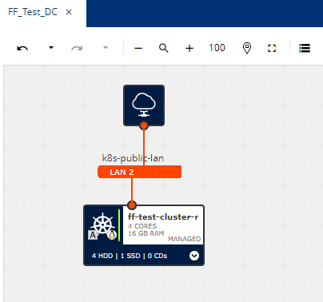

# Deployment IONOS Environment with Fiware

## Deployment Architecture Overview

This deployment aims to deploy [https://github.com/FIWARE/data-space-connector](https://github.com/FIWARE/data-space-connector) in the IONOS environment.



### Deployed IONOS Components

- DataCenter:
  - Name FF_Test_DC

- Kubernetes Cluster:
  - Name: FF_Test_Cluster

- Kubernetes Cluster NodePool:
  - Name: FF_Test_Cluster_NodePool
  - CPU: Count: 1 AMD, 4 Core
  - 16GB RAM
  - 50 GB Storage SSD

- Cluster connection steps:
  - Download kubeconfig.yaml to your local machine from cluster settings
  - Save to kubeconfig.yaml in folder .kube
  - Set KUBECONFIG variable to the route of the dowloaded jubeconfig.yaml file using the command:

    ```sh
    export KUBECONFIG=/Users/{user}/.kube/kubeconfig.yaml
    ```

  - Check default Kubernetes resources using command:

    ```sh
    kubectl get all --all-namespaces
    ```

### Deployment

1. Install helm following instructions in [https://helm.sh/docs/intro/install/](https://helm.sh/docs/intro/install/)

2. Add the FIWARE helm repository

    ```sh
    helm repo add dsc https://fiware.github.io/data-space-connector/ --force-update
    ```

3. Update your environment: This folder contains a file named **fw_env.sh.example**. Copy this file to **fw_env.sh** and set the **partner_suffix** to the deployment name (e.g. -ntt). Then source the file into your environment

    ```sh
    source fw_env.sh
    ```

4. Install ngix as Ingress Controller

    ```sh
    helm upgrade --install ingress-nginx ingress-nginx \
    --repo https://kubernetes.github.io/ingress-nginx \
    --namespace ingress-nginx --create-namespace
    ```

5. Install Cert-Manager
  
    - Add repo

      ```sh
      helm repo add jetstack https://charts.jetstack.io --force-update 
      ```

    - Install cert manager

      ```sh
      helm install \
      cert-manager jetstack/cert-manager \
      --namespace cert-manager \
      --create-namespace \
      --version v1.15.1 \
      --set crds.enabled=true
      ```

6. Deploy cluster isssuers

    - Open `letsencrypt_staging.yaml` and `letsencrypt_production.yaml` files and change to your email-address
  
    - After changing email, apply both ClusterIssuers:
  
      ```sh
      kubectl apply -f letsencrypt_staging.yaml
      kubectl apply -f letsencrypt_production.yaml
      ```

    - Check status Ready = True for both of the Clusterissuers
  
      ```sh
      kubectl get clusterissuer --all-namespaces
      ```

7. Deploy the FIWARE environment

    ```sh
    ./fw_deploy_all.sh
    ```

    This will deploy the **provider** namespace, including TM Forum APIs (the marketplace) and the provider components, and a **consumer** namespace.
  
8. Fix ingress routes

    - Download wrong ingress file

       ```sh
       kubectl get ingress myprovider-apisix-control-plane -n provider -o yaml > myprovider-apisix-control-plane-ingress.yaml
       ```

    - Open downloaded file with text editor

      ```sh
      nano myprovider-apisix-control-plane-ingress.yaml
      ```

    - Change spec.rules.http.paths.backend.service.port.name and save the file after **http-admin** to **http-admin-api**

    - Reupload changed ingress file

      ```sh
      kubectl replace -f myprovider-apisix-control-plane-ingress.yaml
      ```

    - Expected result in terminal: **ingress.networking.k8s.io/mydsc-apisix-control-plane replaced**

Congratulations! You have the FIWARE setup up and running.

### Run tests

Before you run the tests, make sure your current environment has all environment variables available. You can do this by running

```sh
./fw_env.sh
```

Then you can follow the documentation in [Fiware Setup](doc/fiware_setup.md) to run the tests.

### Shut down

To undeploy the environment run

```sh
./fw_shutdown_all.sh
```
