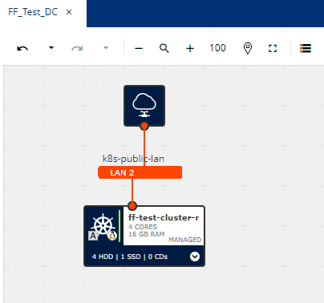

## Deployment IONOS Environment with Fiware
### Deployment Architecture Overview
**This deployment aims to deploy [https://github.com/FIWARE/data-space-connector](https://github.com/FIWARE/data-space-connector) in the IONOS environment.**
 

#### Deployed IONOS Components:

- DataCenter:
    - Name FF_Test_DC

- Kubernetes Cluster:
    - Name: FF_Test_Cluster

- Kubernetes Cluster NodePool:
    - Name: FF_Test_Cluster_NodePool
    - CPU: Count: 1 AMD, 4 Core
    -  16GB RAM
    - 50 GB Storage SSD

- Cluster connection steps:
    - Download kubeconfig.yaml to your local machine from cluster settings
    - Save to kubeconfig.yaml in folder .kube
    - Set KUBECONFIG variable to the route of the dowloaded jubeconfig.yaml file using the command: 
    
            export KUBECONFIG=/Users/{user}/.kube/kubeconfig.yaml
    - Check default Kubernetes resources using command: 
        
            kubectl get all --all-namespaces

#### Deployment ##### 

1. Download the following files in your computer:
    - `values_ionos_ta.yaml`
    - `values_ionos.yaml`
    - `redeploy.sh`
    - `letsencrypt_staging.yaml`
    - `letsencrypt_production.yaml`

2. Install helm following instructions in [https://helm.sh/docs/intro/install/](https://helm.sh/docs/intro/install/) 

3. Add helm repository 

        helm repo add dsc https://fiware-ops.github.io/data-space-connector/

4. Install trust-anchor

    - Use the following command: 

            helm install mytrustanchor dsc/trust-anchor -n trust-anchor --create-namespace -f values_ionos_ta.yaml
    - Verify installation: 

            kubectl get all -n trust-anchor

5. Install FIWARE Dataspace Connector 
    - Use the following command:
        
            helm install mydsc dsc/data-space-connector -n dsc --create-namespace -f values_ionos.yaml
    - Verify installation: 

            kubectl get all -n dsc

6. Install ngix as Ingress Controller 

        helm upgrade --install ingress-nginx ingress-nginx \
        --repo https://kubernetes.github.io/ingress-nginx \
        --namespace ingress-nginx --create-namespace

7. Install Cert-Manager 
    - Add repo 

            helm repo add jetstack https://charts.jetstack.io --force-update 

    - Install cert manager

            helm install \
            cert-manager jetstack/cert-manager \
            --namespace cert-manager \
            --create-namespace \
            --version v1.15.1 \
            --set crds.enabled=true

8. Deploy cluster isssuers 

    - Open `letsencrypt_staging.yaml` and
`letsencrypt_production.yaml` files and change to your email-address

    - After changing email, apply both ClusterIssuers: 
    
          kubectl apply -f letsencrypt_staging.yaml

          kubectl apply -f letsencrypt_production.yaml

    - Check status Ready = True for both of the Clusterissuers

          kubectl get clusterissuer --all-namespaces

- Networks:
  - Name: N\A
  - Type:  Internet Access (via LAN2)
  
