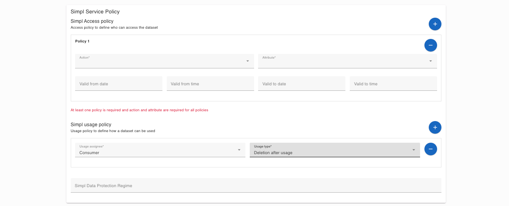

## [2.1.3.2] Data product publication: Provision - Reuse or create usage control policies / functions
### Stack: SIMPL

### Statement of assessment
#### Environment
The testing environment is an IMEC self-deployed instances of [Simpl-Open](https://code.europa.eu/simpl/simpl-open) on an IONOS Kubernetes cluster, the version used is 1.0.

#### Tested quality metric and method
The quality metric for this test is based on the criteria outlined in [iso27001_kpis_subkpis.xlsx](../../../../../design_decisions/background_info/iso27001_kpis_subkpis.xlsx). In Phase 1, the focus is on the Functional Suitability metric. For detailed information, please refer to the [Comparative criteria (checklists, ...)](./test.md#comparative-criteria-checklists-) section in the test description.

#### Expected output
The test aims to assess the ease of use of deploying Usage Control Policies in regard to the availability of a user interface.

### Results
#### Assessment
SIMPL provide a user interface for deploying Usage Control Policies when the data provider publish a data offereing.
Several pre-defined policies are available in the UI.

#### Measured results
As demonstrated, SIMPL offers a user interface for adding policies, allowing multiple policies to be added or deleted before the data offering is published. However, policies are not manageable after submission.

**Functional Suitability Quality Metric: 3**
