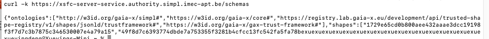

## [2.1.2.2] Data product publication: Provision - Submit vocabulary artifacts
### Stack: SIMPL

### Stack: SIMPL

#### Tested quality metric and method

The quality metric for this test is based on the criteria outlined in [iso27001_kpis_subkpis.xlsx](../../../../../design_decisions/background_info/iso27001_kpis_subkpis.xlsx).
In Phase 1, the focus is on the Functional Suitability metric. For detailed information, please refer to the [Comparative criteria (checklists, ...)](./test.md#comparative-criteria-checklists-) section in the test description.

#### Expected output
The test aims to verify if a data space participant can publish new vocabularies (test vocabulary) and if the vocabulary hub provides appropriate feedback on the operation.
### Results
#### Assessment
As stated in [test_2.1.2.1_result_simpl.md](../test_2_1_2_1/result_simpl.md), SIMPL does not provide a separate vocabulary hub function for validating the data sharing process.

It is important to explain the ontologies and vocabularies in the current testing context. Vocabularies are the terms used in a certain context, and ontologies define the class and type of these words, such as `owl:DatatypeProperty` and `owl:Class`. The actual validation for data expressed in RDF is the schema, which means the cardinality and data type of the terms, usually expressed in SHACL shapes.

SIMPL employs the GAIA-X federated catalog services: [simpl-fc-service](https://code.europa.eu/simpl/simpl-open/development/gaia-x-edc/simpl-fc-service), 
which has schema validation for ontologies and vocabularies of data product offerings. 

This component offers an [open API](https://code.europa.eu/simpl/simpl-open/development/gaia-x-edc/simpl-fc-service/-/blob/main/openapi/fc_openapi.yaml?ref_type=heads) for publishing new schemas (including SHACL shapes, ontologies, and vocabularies).
Through the schema endpoint, we can consult which schemas have been published to the service.

#### Measured results
As stated above, we have not seen the possibility for a data provider to publish new vocabularies for the data sharing process in SIMPL. However, this is possible for the data offering process in SIMPL. Therefore, based on the [Evaluation Criteria](./test.md#evaluation-criteria-), the following scores are assigned to the test:

- Can the data provider submit a new vocabulary? - No, not for data sharing, but yes for data offering
- Can the data provider choose from different standardized vocabulary that meet the requirements of the data source? - No
- Can the data provider submit custom metadata fields and link their semantic definition? - No
- Can the data provider access standardize vocabularies to then use them in the data source before provisioning the data? - No
- Does the EMDS interoperability facility validate the vocabulary used at the data source? - No
- Does the system provide feedback or error messages if a vocabulary submission fails validation? - No 

#### Notes
The current testing version of SIMPL is a very basic Minimum Viable Product solution, version 1.0. 