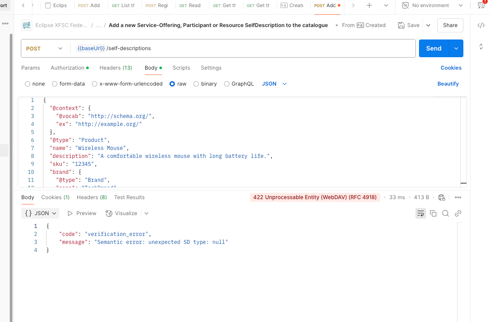

## [2.1.2.5] Data product publication: Provision - Submit vocabulary artifacts
### Stack: SIMPL

#### Tested quality metric and method

The quality metric for this test is based on the criteria outlined in [iso27001_kpis_subkpis.xlsx](../../../../../design_decisions/background_info/iso27001_kpis_subkpis.xlsx). In Phase 1,
the focus is on the Functional Suitability metric. For detailed information, please refer to the [Comparative criteria (checklists, ...)](./test.md#comparative-criteria-checklists-) section in the test description.

#### Expected output
The test aims to assess that the vocabulary hub validates a new entry (or modification to an existing vocabulary). Test the validation process by submitting a test vocabulary, and assess if the service provides a feedback on the result validation.

### Results
#### Assessment

As mentioned in the [test_2.1.1.2_result_simpl.md](../test_2_1_2_1/result_simpl.md), 
SIMPL currently does not have an implementation for a vocabulary hub for data sharing. 

However, SIMPL utilizes the Gaia-X federated catalog service [simpl-fc-service](https://code.europa.eu/simpl/simpl-open/development/gaia-x-edc/simpl-fc-service) for schema validation of ontologies and vocabularies during data product offerings.
This service provides an API to publish a self-description (a type of verifiable presentation). When calling the specific API for publishing `/self-descriptions`, 
the service validates the self-description against the SHACL shapes and returns the validation result, as shown below:

The detailed flow can be found [here](https://gaia-x.gitlab.io/data-infrastructure-federation-services/cat/architecture-document/architecture/catalogue-architecture.html#_adding_a_self_description_for_an_offering).

#### Measured results
As mentioned above, there is no possibility for a data provider to get validation results for sharing data. However, schema validation feedback is available in the data offering process in SIMPL for the offering itself.
Therefore, based on the [Evaluation Criteria](./test.md#evaluation-criteria-), the following scores are assigned to the test:

- Does the vocabulary hub validate new entries or modifications to existing vocabularies? -> No, not for data sharing process
- Is the validation process for new or modified vocabularies executed successfully? - No
- Does the system provide feedback or error messages if the validation fails? - No, not for data sharing process
- Can the data provider view the validation status of the submitted or modified vocabulary? - No, not for data sharing process
- Are there mechanisms in place to handle validation errors and provide corrective actions? - No, not for data sharing process
- Is there a log or audit trail available for the validation process of vocabulary entries or modifications? - No, not for data sharing process

**Functional Suitability Quality Metric Score: 0**

#### Notes
The current testing version of SIMPL is a very basic Minimum Viable Product solution, version 1.0. 