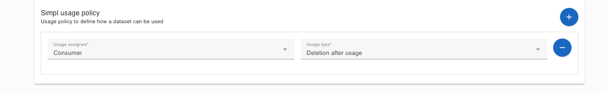

## [2.2.2.1] Data product publication: Publication - Deploy/config usage control functions
### Stack: SIMPL

### Statement of assessment
#### Environment

The testing environment is an IMEC self-deployed instances of [Simpl-Open](https://code.europa.eu/simpl/simpl-open) on
an IONOS Kubernetes cluster, the version used is 1.0.

#### Tested quality metric and method

The quality metric for this test is based on the criteria outlined in [iso27001_kpis_subkpis.xlsx](../../../../../design_decisions/background_info/iso27001_kpis_subkpis.xlsx). In Phase 1,
the focus is on the Functional Suitability metric. For detailed information, please refer to the [Comparative criteria (checklists, ...)](./test.md#comparative-criteria-checklists-) section in the test description.

#### Expected output

The expected output of the test is an assessment of the completeness of the administrative interface (either API or GUI) so that it covers the most needed use cases for the deployment of usage policies.

### Results
#### Assessment
[Simpl-Open](https://code.europa.eu/simpl/simpl-open) utilizes the [SIMPL EDC Connection](https://code.europa.eu/simpl/simpl-open/development/gaia-x-edc/simpl-edc) to manage the [Dataspace Protocol](https://docs.internationaldataspaces.org/ids-knowledgebase/dataspace-protocol). The [SIMPL EDC Connection](https://code.europa.eu/simpl/simpl-open/development/gaia-x-edc/simpl-edc) includes the management API and policy engine of the EDC connector, 
thus SIMPL shares the same API functions for managing policies as described in [result_edc_vc.md](result_edc_vc.md). 

Additionally, the [SIMPL EDC Connection](https://code.europa.eu/simpl/simpl-open/development/gaia-x-edc/simpl-edc) implements the EDC policy engine for [consumption access constraints](https://code.europa.eu/simpl/simpl-open/development/gaia-x-edc/simpl-edc/-/blob/main/src/main/java/eu/europa/ec/simpl/ConsumptionConstraintFunction.java?ref_type=heads) and [location access constraints](https://code.europa.eu/simpl/simpl-open/development/gaia-x-edc/simpl-edc/-/blob/main/src/main/java/eu/europa/ec/simpl/LocationConstraintFunction.java?ref_type=heads).

To facilitate the creation of policies, SIMPL offers the [SIMPL Self Description UI](https://code.europa.eu/simpl/simpl-open/development/gaia-x-edc/simpl-sd-ui), which assists data providers in creating a self-description of the data product. This self-description includes access and usage policies, and the UI contains predefined policies.

However, the [SIMPL Self Description UI](https://code.europa.eu/simpl/simpl-open/development/gaia-x-edc/simpl-sd-ui) is a very basic component. 
It only provides the functionality to add and publish policies to the data offering, but it does not allow customization or modification of the policies. 
also, there is no way to delete policies once they are attached to the data offering.

#### Measured results
As mentioned above, SIMPL shares the same API results as the EDC connector since it uses the EDC policy engine and management API.
However, SIMPL's contributions to the Dataspace ecosystem lie in its UI features.
Therefore, this test will be evaluated based on its UI features.
Given that the UI is very basic and minimalistic, and the deliverable of SIMPL is deployment on a Kubernetes cluster, users might have difficulties directly accessing the API.
The following scores have been assigned to the test:

| **Criterion**                | **Description**                                                                                     | **Score (0-4)** |
|------------------------------|-----------------------------------------------------------------------------------------------------|-----------------|
| **Functional Completeness**   | Technical requirements cover all the specified tasks and user objectives.                          | 1               |
| **Functional Correctness**    | Technical requirements meet results with the needed degree of precision.                           | 1               |
| **Functional Appropriateness**| Technical requirements facilitate the accomplishment of specified tasks and objectives.            | 1               |

**Functional Suitability Quality Metric Score: 1**

#### Notes

The current testing version of SIMPL is a very basic Minimum Viable Product solution, version 1.0.   

   
