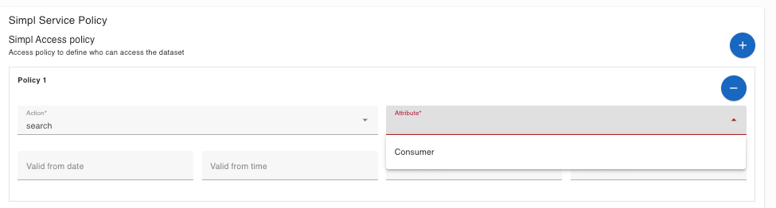
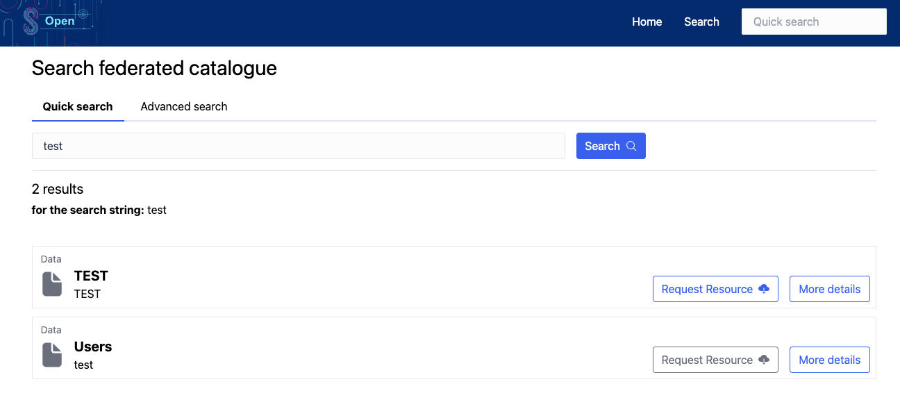

## [2.2.3.1A] Data product publication: Publication - Publication on EMDS catalogue
### Stack: SIMPL

### Statement of assessment
#### Environment
The testing environment is an IMEC self-deployed instances of [Simpl-Open](https://code.europa.eu/simpl/simpl-open) on an IONOS Kubernetes cluster, the version used is 1.0.

#### Tested quality metric and method
The quality metric for this test is based on the criteria outlined in [iso27001_kpis_subkpis.xlsx](../../../../../design_decisions/background_info/iso27001_kpis_subkpis.xlsx). In Phase 1, the focus is on the Functional Suitability metric. For detailed information, please refer to the [Comparative criteria (checklists, ...)](./test.md#comparative-criteria-checklists-) section in the test description.

#### Expected output
The test aims to examine the process of catalog publication for a data product under the following conditions: a new data product is added to the catalog. The EMDS catalog, as defined in the relevant documentation,
refers to the Data Space-only catalog, specifically the internal SIMPL catalog and its federation component.

### Results
#### Assessment

SIMPL Provider 3 types of Services offering described by self-description:
- Application offering
- Infrastructure offering
- Data offering
When creating the data offering, the data provider could set access policy to define who can access the dataset.

As the example above, only consumer role user can search the dataset from its catalog.

Once the data offering is published, the consumer can go to its catalog to search the dataset. SIMPL provides a user-friendly interface for the consumer to search the dataset.

#### Measured results
As demonstrated above, SIMPL provides an open-box process for publishing a data product (data asset along with its policies and contract). This process makes the data product available in the connector catalog or the federated catalog. Based on the criteria outlined in the [Comparative criteria (checklists, ...)](./test.md#comparative-criteria-checklists-) section of the test description, the test is assigned the following score:

**Functional Suitability Quality Metric: 4**
