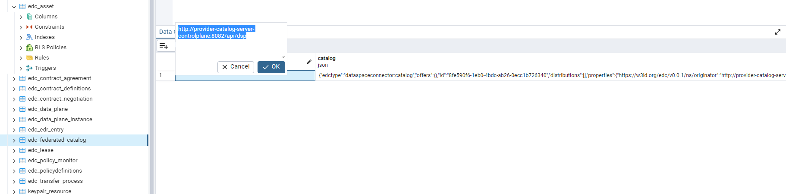

## [2.2.3.1D] Data product publication: Publication - Publication on EMDS catalogue

### Stack: EDC+VC

### Statement of assessment

#### Environment
- The test utilizes the EDC MVD commit [9a5f93c](https://github.com/eclipse-edc/MinimumViableDataspace/commit/9a5f93c89cf5624cc4bf8eaa024a29da9b8e3d12).
- EDC version [0.8.1-snapshot](https://github.com/eclipse-edc/MinimumViableDataspace/blob/9a5f93c89cf5624cc4bf8eaa024a29da9b8e3d12/gradle/libs.versions.toml#L7)
- The test is executed in an Ubuntu environment using IntelliJ.

#### Tested quality metric and method
The quality metric for this test is based on the criteria outlined in [iso27001_kpis_subkpis.xlsx](../../../../../design_decisions/background_info/iso27001_kpis_subkpis.xlsx). In Phase 1, the focus is on the Functional Suitability metric. For detailed information, please refer to the [Comparative criteria (checklists, ...)](./test.md#comparative-criteria-checklists-) section in the test description.

#### Expected output
The test aims to examine the process of catalog de-publication for a data product under the following conditions: a data product is removed (de-published) from the catalog. The EMDS catalog, as defined in the relevant documentation, refers to the Data Space-only catalog, specifically the internal EDC catalog and its federation component.

### Results

#### Assessment

EDC does not offer a direct endpoint for (de)publishing a catalog. Instead, the process involves a series of API calls to publish individual components: an asset, its associated policy, and its contract. EDC then extracts this information and dynamically constructs a catalog whenever a request is made. Consequently, publishing a data asset along with its policy and contract results in the creation or updating of the catalog. \
Conversely, if you remove a data asset, EDC connector will automatically update the catalog to reflect this change.
##### Connector Catalogue
From the EDC MVD commit [9a5f93c](https://github.com/eclipse-edc/MinimumViableDataspace/commit/9a5f93c89cf5624cc4bf8eaa024a29da9b8e3d12), we observe that EDC provides APIs for managing data products (assets), including their de-publication:

```sh
curl -X 'DELETE' \
'https://{Connector}/v3/assets/{Asset-ID}' \
-H 'accept: */*'
```

This `curl` command is used to remove the specified data product (asset) from the connector. Since the connector does not maintain a local persistent catalog and generates the catalog dynamically, querying the catalog via the endpoint `{{Connector}}/api/management/v3/catalog/request` will reflect the current state of the catalog.
The test demonstrates that de-publishing an asset will remove it from the catalog returned by this endpoint.

#### Federated Catalog
As mentioned in [Test 2.2.3.1a](../test_2_2_3_1a/result_edc_vc.md), EDC provides a ready-to-use [Federated Catalog Solution](https://github.com/eclipse-edc/FederatedCatalog). This solution employs a set number of crawlers to periodically scan the dataspace, request catalogs from each participant in a predefined list, and consolidate them into a local persistence. The federated catalog also offers [API endpoints](https://github.com/eclipse-edc/FederatedCatalog/blob/gh-pages/openapi/management-api/0.8.1-SNAPSHOT/management-api.yaml) for querying the catalogs. The Federated Catalog is integrated into the EDC MVD commit [9a5f93c](https://github.com/eclipse-edc/MinimumViableDataspace/commit/9a5f93c89cf5624cc4bf8eaa024a29da9b8e3d12) within the connector. \
Test results from the MVD indicate that the Federated Catalog has its own local persistence. 

The persistence can be saved in the database, as shown above, identified by the DSP endpoint. De-publishing a data asset will result in the catalog being refreshed at the result of DSP query endpoint, as explained above. Therefore, the asset will also be removed from the Federated Catalog.
The crawling pace can be configured with following keys:

```text
edc.catalog.cache.execution.delay.seconds
edc.catalog.cache.execution.period.seconds
edc.catalog.cache.partition.num.crawlers
```

#### Measured results
As demonstrated above, EDC provides an out-of-the-box process for de-publishing a data product (including the data asset, policies, and contract) from the catalog. This de-publishing process is also reflected in the federated catalog. Therefore, based on the criteria outlined in the [Comparative criteria (checklists, ...)](./test.md#comparative-criteria-checklists-) section of the test description, the test is assigned the following score:

**Functional Suitability Quality Metric: 4**

#### Notes

EDC is a pluggable ecosystem primarily targeting Java/Kotlin developers. Some extensions are available on the market for plug-and-play, but for certain specific use cases, developers need to create their own extensions.