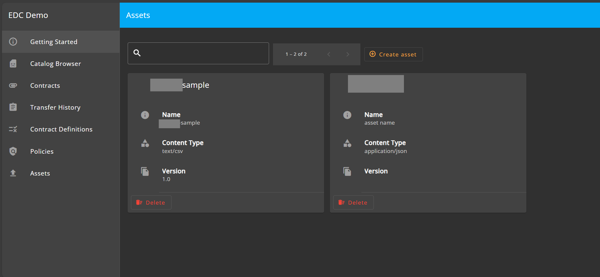
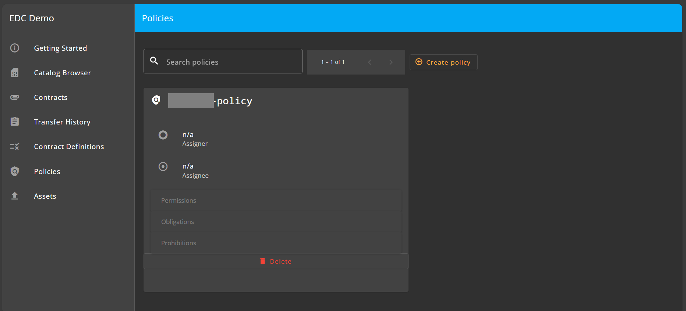
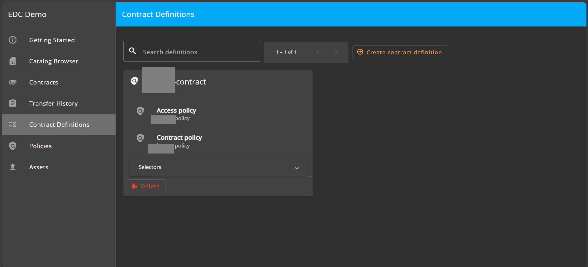
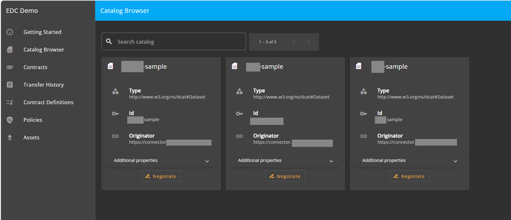

## [2.2.3.3] Data product publication: Publication - Publication on EMDS catalogue
### Stack: EDC+VC

### Statement of assessment
#### Environment
- The test leverages the EDC MVD commit [8da0c4e](https://github.com/eclipse-edc/MinimumViableDataspace/commit/8da0c4e6a8921dcb6ff189c2901868979bdc9a93).
- It uses EDC version [0.8.2-SNAPSHOT](https://github.com/eclipse-edc/MinimumViableDataspace/blob/8da0c4e6a8921dcb6ff189c2901868979bdc9a93/gradle/libs.versions.toml#L7).
- The test is performed on an Ubuntu environment with IntelliJ.

#### Tested quality metric and method
The quality metric for this test is based on the criteria outlined in [iso27001_kpis_subkpis.xlsx](../../../../../design_decisions/background_info/iso27001_kpis_subkpis.xlsx).\
For the current phase (Phase 1), the test focuses on the Functional Suitability metric.

#### Comparative criteria (checklists, ...)
[TODO] Describe the comparative criteria used for the test / assessment. If possible, align with the criteria used for the same test in the other stack(s).

#### Expected output
The test aims to verify the availability of a GUI for publishing a data product offering into the catalog and discovery tools.

### Results
#### Assessment
As detailed in [test_2_2_3_1d](../test_2_2_3_1d/result_fiware.md), EDC does not offer a direct endpoint for publishing or unpublishing a catalog. Instead, the process requires a sequence of API calls to publish individual components, including an asset, its associated policy, and its contract. EDC then dynamically generates a catalog by aggregating this data upon request. Thus, publishing a data asset along with its policy and contract results in the creation or updating of the catalog.\
EDC provides a [dashboard solution](https://github.com/eclipse-edc/DataDashboard) that offers a graphical UI for users to publish data assets, policies, and contracts.\

The EDC dashboard also includes a catalog search feature, as shown below:

However, dashboards have not yet been integrated into the EDC MVD commit [8da0c4e](https://github.com/eclipse-edc/MinimumViableDataspace/commit/8da0c4e6a8921dcb6ff189c2901868979bdc9a93), and according to a Discord conversation on 07/09/2024, there is no plan from the EDC team to integrate it into the MVD due to their development team’s bandwidth constraints.
#### Measured results
As outlined above, EDC provides a native GUI solution: [dashboard solution](https://github.com/eclipse-edc/DataDashboard) for publishing data products, resulting in a searchable catalog. Therefore, the following score is assigned to the test:

**Functional Suitability Quality Metric: 4**
#### Notes
EDC is a pluggable ecosystem primarily targeting Java/Kotlin developers. Some extensions are available on the market for plug-and-play, but for certain specific use cases, developers need to create their own extensions.