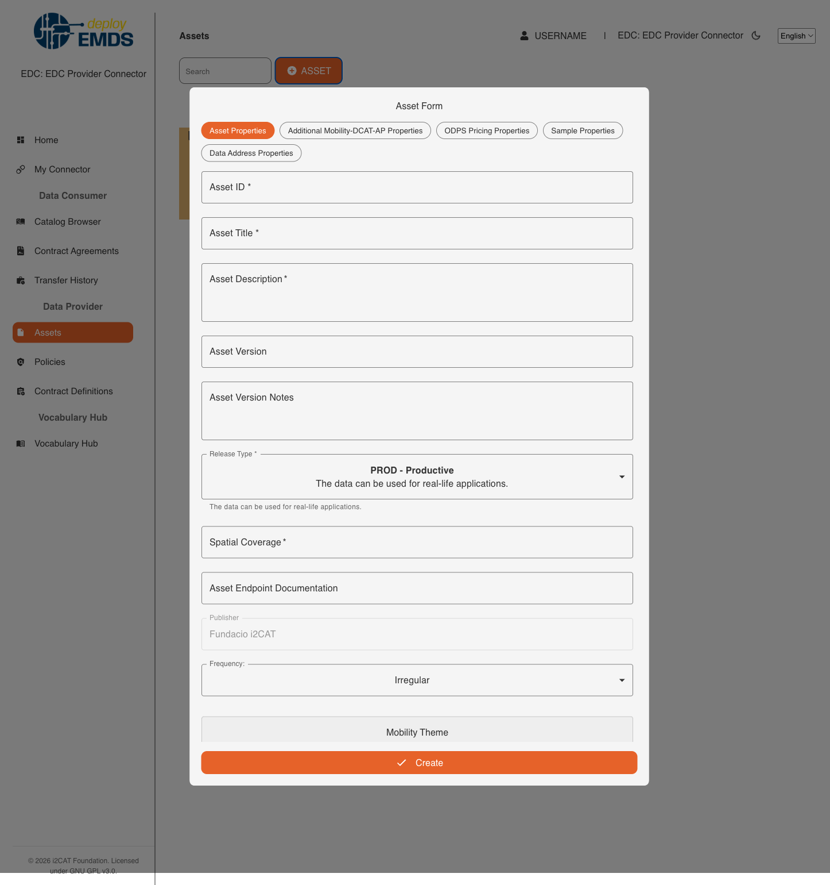

## [2.2.3.3] Data product publication: Publication - Publication on EMDS catalogue

### Stack: protoEMDS Final Stack (EDC-based)

### Statement of assessment

#### Environment

This section identifies the technical context in which the protoEMDS Final Stack assessment is performed.

| Field | Value |
| --- | --- |
| Assessment context | Integration phase assessment of the EMDS final technical infrastructure |
| Result perspective | `protoemds_final_stack` |
| Stack under assessment | protoEMDS Final Stack (EDC-based) |
| KPI1 area | Catalogue publication |
| Existing test ID | `2.2.3.3` |
| Level | UC + Technical |
| ISO/IEC 25010 mapping | Functional suitability, Compatibility |
| Owner | Casper (imec, @vghelu49) |
| Reviewer | Alessio |
| Deployment model assessed | CaaS / IONOS-managed deployment |
| Target environment | IONOS-managed CaaS deployment |
| EDC version / release | `emds-edc-connector` `9916cc5`, based on Eclipse EDC `0.10.0` |
| Connector deployment reference | `deployEMDS-k8s-deployment`, branch `prepare-prod`, commit `846e5f1` |
| Assessment evidence | Playwright UI verification and Bruno CLI API execution |

The assessment should be completed using the deployment model for which evidence is realistically available. It is not mandatory to execute the same test in both CaaS and on-premise environments.

The deployment models are assessed independently. The CaaS assessment is
complete. The on-premise assessment remains `TBD`.

#### Tested quality metric and method

This result reuses the existing stack-agnostic test definition in `test.md` and adds a protoEMDS Final Stack integration-assessment perspective.

It does not replace the historical stack-specific result files, such as `result_edc_vc.md` or `result_fiware.md`.

The quality metric, expected output and comparative criteria remain those defined by the original test. This result file should only capture the evidence and assessment outcome for the selected protoEMDS Final Stack deployment.

#### Test-specific assessment scope

Assess that a GUI for the functionality to publish a data product offering into the catalogue and discovery tools is available.

#### Expected Output

The test aims to verify the availability of a GUI for publishing a data product offering into the catalog and discovery tools.

### Results

#### Assessment

The connector UI has separate screens for assets, policies, contract
definitions, and catalogues. The available controls include:

- an asset list, search box, and asset-creation form
- core metadata, MobilityDCAT-AP, ODPS pricing, sample, and data-address tabs
- policy creation with permission, prohibition, and obligation rules
- contract-definition creation linking policies and one or more assets
- a catalogue browser that queries a counterparty by DSP address and DID and
  displays the resulting product and policy details.

After the connector password was entered, Management API requests returned
`200 OK`. The API-created product appeared in both the asset list and the
catalogue browser. A complete publication was not submitted through the UI.
The catalogue browser has no free-text search, metadata filters, or pagination
controls.



The screenshot shows the asset publication form with fields for the asset
identifier, title, description, version, data address, publisher, frequency,
and mobility theme. It also shows the available tabs for data address,
MobilityDCAT-AP, pricing, sample, and policy information.

#### Deployment model assessed

| Deployment model | Status | Evidence | Consolidated assessment |
| --- | --- | --- | --- |
| CaaS / IONOS-managed deployment | Assessed | Playwright UI and Bruno CLI | GUI supports asset, policy, and contract-definition workflows plus basic catalogue browsing. |
| On-premise deployment | TBD | TBD | To be assessed separately. |

#### Measured results

| Criteria | Measured KPI | Evidence | Notes |
| --- | ---: | --- | --- |
| **No Coverage:** No technical requirements are met. The solution does not have a GUI tool for publishing a data product offering into the catalogue and enabling discovery. The system does not provide any GUI means for users to interact with or manage data product offerings. | Not selected | UI inspection | A native connector GUI is deployed. |
| **Minimal Coverage:** Up to 25% of the technical requirements are met. The solution provides limited functionality, such as a basic GUI tool with minimal features, allowing for partial publication of data products but lacks robust discovery options. User interface might be clunky, and only a few essential functions are available. | Not selected | UI inspection | The GUI covers all three publication resources and basic discovery. |
| **Partial Coverage:** Approximately 50% of the technical requirements are met. The solution includes a GUI tool that allows for the publication of data products and some discovery features. However, it lacks advanced functionality, such as customizable search options, detailed metadata management, or integration with other systems. Usability and user experience are moderately acceptable. | **2** | UI and API execution | Publication forms and detailed metadata management are available, and catalogue browsing works. Advanced discovery filters, pagination, and external integrations were not demonstrated. |
| **Significant Coverage:** About 80% of the technical requirements are met. The solution offers a comprehensive GUI tool with most required features, such as advanced publication workflows, robust discovery capabilities, customizable search filters, and metadata management. Integration with other systems and platforms is partially supported, and the user experience is generally smooth. However, some advanced features or full system integration might still be lacking. | Not selected | UI inspection | Robust discovery and customizable search filters are absent. |
| **Full Coverage:** All technical requirements are fully met. The solution includes a fully featured GUI tool for publishing data product offerings into the catalogue, complete with advanced discovery features, customizable search options, detailed metadata management, and full integration with other systems. The user interface is intuitive and user-friendly, providing an excellent user experience. | Not selected | UI inspection | Advanced discovery and full external integration were not demonstrated. |

**Functional Suitability Quality Metric:** 2

The UI provides the main publication forms and basic catalogue browsing, but a
full UI submission was not executed. The missing search, filtering, and
pagination controls also limit the discovery workflow. This matches the
Partial Coverage criterion.

#### Execution and evidence

The evidence snippets use generic participant labels. Credentials, hostnames,
and participant-specific identifiers are omitted. Disposable test IDs are
retained to keep the workflow concrete.

**Sanitized UI workflow**

```javascript
await page.goto("https://<connector-host>/dashboard/")
await page.getByRole("link", {name: "Assets"}).click()
await page.getByRole("button", {name: "Create asset"}).click()
await page.getByLabel("Title").fill("Flanders catalogue integration test")
await page.getByRole("link", {name: "Policies"}).click()
await page.getByRole("link", {name: "Contract definitions"}).click()
await page.getByRole("link", {name: "Catalog browser"}).click()
await page.getByLabel("Counterparty DSP address").fill(
  "https://<provider-host>/api/dsp"
)
await page.getByLabel("Counterparty DID").fill("did:web:<provider-host>")
await page.getByRole("button", {name: "Catalog"}).click()
```

The supporting API fixture used the following sanitized request sequence:

```yaml
sequence:
  - POST /api/management/v3/assets
  - POST /api/management/v3/policydefinitions
  - POST /api/management/v3/contractdefinitions
  - POST /api/management/v3/catalog/request
assertions:
  - every mutation returns HTTP 200
  - the catalogue contains the configured asset ID
  - the UI displays the asset and policy details
```

The supporting catalogue response excerpt was:

```json
{
  "dcat:dataset": [
    {
      "@id": "fla01-cat-test-asset-01",
      "dct:title": "Flanders catalogue integration test"
    }
  ]
}
```

| Evidence | Sanitized observation |
| --- | --- |
| UI-01 | Asset, policy, contract-definition, and catalogue screens were available. |
| UI-02 | The catalogue browser displayed the published product. |
| UI-03 | Advanced search, filtering, and pagination were not available. |
| Screenshot | [Publication form screenshot](./images/publication-form-protoemds-final-stack.png) |

#### Notes

This result introduces a **protoEMDS Final Stack** perspective for the existing test `2.2.3.3` under the KPI1 area **Catalogue publication**.

This result should not be interpreted as part of the original Phase 1 / Phase 2 stack-comparison campaign. It is intended as an integration phase assessment of the current EMDS final technical infrastructure.

The score applies to the assessed CaaS deployment. The on-premise result
remains TBD for a separate assessment.
