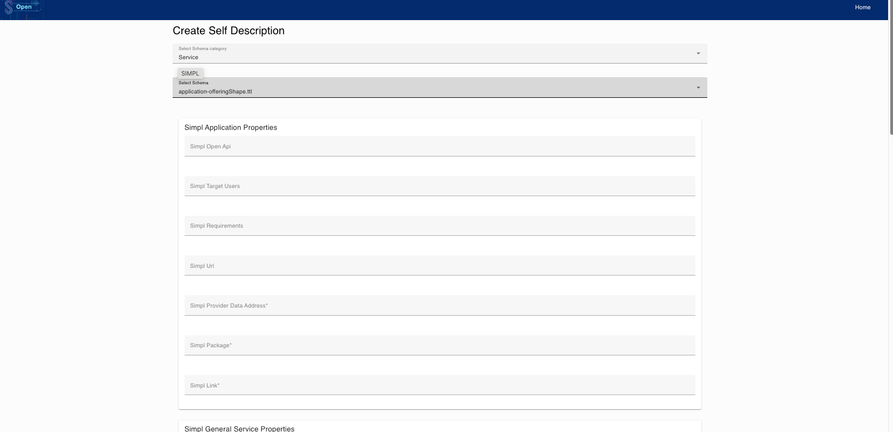
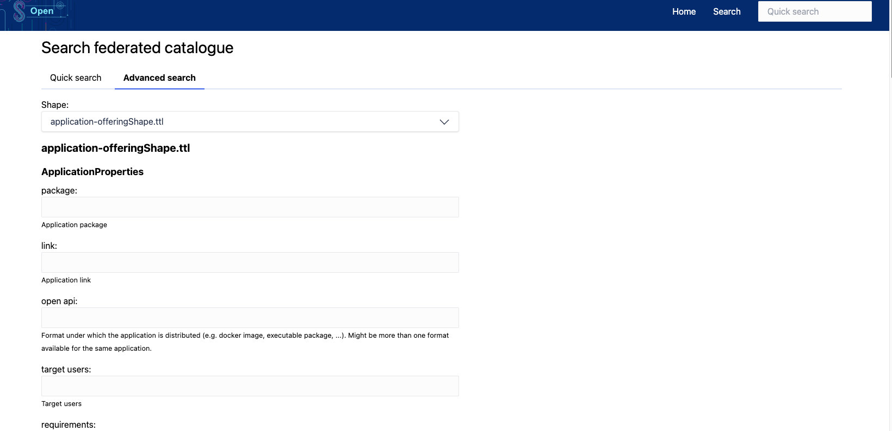

## [2.2.3.3] Data product publication: Publication - Publication on EMDS catalogue
### Stack: SIMPL

### Statement of assessment
#### Environment
The testing environment is an IMEC self-deployed instances of [Simpl-Open](https://code.europa.eu/simpl/simpl-open) on an IONOS Kubernetes cluster, the version used is 1.0.

#### Tested quality metric and method
The quality metric for this test is based on the criteria outlined in [iso27001_kpis_subkpis.xlsx](../../../../../design_decisions/background_info/iso27001_kpis_subkpis.xlsx). In Phase 1, the focus is on the Functional Suitability metric. For detailed information, please refer to the [Comparative criteria (checklists, ...)](./test.md#comparative-criteria-checklists-) section in the test description.

#### Expected output
The test aims to verify the availability of a GUI for publishing a data product offering into the catalog and discovery tools.

### Results
#### Assessment
SIMPL is a project aimed at providing facilities for data spaces. It includes a data offering UI for participants, which can publish the following types of data projects:
- Services
  - Infrastructure offering
  - Application offering
  - Data offering
- Contract
The SIMPL UI also includes functionality to validate the input information (Self Description) for each product type, using web page input validation and the SHACL shapes validation defined for each product type.

For dataset discovery, SIMPL provides a UI that allows users to search for datasets based on the dataset name or perform advanced searches based on shapes, etc.

#### Measured results
Based on the previous explanation, SIMPL offers a native GUI for data offering and catalog searching. However, as it is a minimum viable product, the UI is not tailored at all, lacking delete functionality, session management, etc. The website only supports basic functions. Therefore, the following score has been assigned to the test:
       
**Functional Suitability Quality Metric: 2**

#### Notes
The current testing version of SIMPL is a very basic Minimum Viable Product solution, version 1.0.