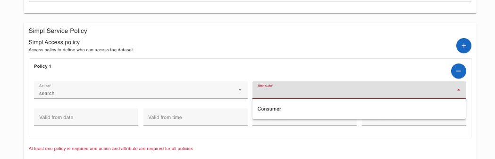

## [2.2.3.4] Data product publication: Publication - Publication on EMDS catalogue
### Stack: Simpl

### Statement of assessment
#### Environment                                                                                                                 
The testing environment is an IMEC self-deployed instances of [Simpl-Open](https://code.europa.eu/simpl/simpl-open) on an IONOS Kubernetes cluster, the version used is 1.0.
                                                                                                                                 
#### Tested quality metric and method                                                                                            
The quality metric for this test is based on the criteria outlined in [iso27001_kpis_subkpis.xlsx](../../../../../design_decisions/background_info/iso27001_kpis_subkpis.xlsx

#### Expected output
This test aims to evaluate the process for de-publishing a catalog or making a catalog entry private.

### Results
#### Assessment
Currently, Simpl does not offer a user interface to de-publish a data product from the catalog. Although Simpl 1.0 uses EDC as a connector, which has an API endpoint for de-publishing datasets, Simpl primarily provides its own data offering and catalog UI. Therefore, it lacks a user interface for de-publishing data products from the catalog.

As mentioned in the previous test, when creating a self-description of a data offering, [Simpl-Open](https://code.europa.eu/simpl/simpl-open) provides access policies for dataset search. Consequently, there is a possibility that the data product may not be visible as private.

#### Measured results
As mentioned earlier, Simpl offers a basic UI function to define access policies for data offerings. However, it lacks a user interface for de-publishing a data product from the catalog. Consequently, based on the criteria outlined in the [Comparative criteria (checklists, ...)](./test.md#comparative-criteria-checklists-) section of the test description, the test is assigned the following score:

**Functional Suitability Quality Metric: 2**

#### Notes                                                                                             
The current testing version of Simpl is a very basic Minimum Viable Product solution, version 1.0.     
