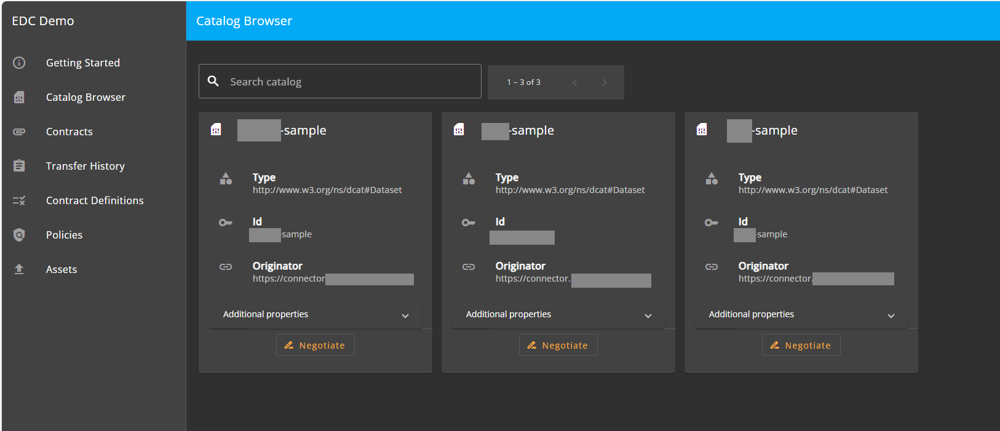

## [3.1.1.1] Data product survey: Discover - Consult data space catalogue
### Stack: EDC+VC

### Statement of assessment
#### Environment
- The test utilizes the EDC MVD commit [8da0c4e](https://github.com/eclipse-edc/MinimumViableDataspace/commit/8da0c4e6a8921dcb6ff189c2901868979bdc9a93).
- EDC version [0.8.2-SNAPSHOT](https://github.com/eclipse-edc/MinimumViableDataspace/blob/8da0c4e6a8921dcb6ff189c2901868979bdc9a93/gradle/libs.versions.toml#L7)
- The test is executed in an Ubuntu environment using IntelliJ.

#### Tested quality metric and method
The quality metric for this test is based on the criteria outlined in [iso27001_kpis_subkpis.xlsx](../../../../../design_decisions/background_info/iso27001_kpis_subkpis.xlsx). In Phase 1, the focus is on the Functional Suitability metric. For detailed information, please refer to the [Comparative criteria (checklists, ...)](./test.md#comparative-criteria-checklists-) section in the test description.

#### Expected output
The test aims to determine whether a native online user experience (U/X) is available and evaluate individual search features. 
If the data space catalog exposes an API, the test assesses the technical effort required to integrate it with a data search tool representative of EU projects.
The criteria for evaluation include being open-source, a hosted solution, or part of an EU-driven project.

### Results
#### Assessment
##### EDC native solution
As demonstrated in the [test_2_2_3_1a](../../../../data_product_publication/publication/publication_on_emds_catalogue/test_2_2_3_1a/result_edc_vc.md), EDC provides API endpoints `management/v3/catalog/request` and `catalog/v1alpha/catalog/query` for querying both the catalog and federated catalog. The [EDC Data Dashboard](https://github.com/eclipse-edc/DataDashboard) can be configured to consume these API endpoints and provide search functionality.

However, dashboards have not yet been integrated into the EDC MVD commit [8da0c4e](https://github.com/eclipse-edc/MinimumViableDataspace/commit/8da0c4e6a8921dcb6ff189c2901868979bdc9a93), and according to a Discord conversation on 07/09/2024, there is no plan from the EDC team to integrate it into the MVD due to their development team’s bandwidth constraints.

##### Integrate catalog API with a data search tool

###### Open-Source Platform (DataHub)

IMEC has investigated how to use the federated catalog API with [DataHub](https://datahubproject.io/). The main development task for this integration is to create an EDC extension that periodically queries the EDC API endpoint and uses the [DataHub emitter](https://datahubproject.io/docs/metadata-integration/java/as-a-library/) to send changes to DataHub.

###### Hosted Solution (Datavindplaats)

IMEC has studied how to integrate the federated catalog endpoint with a hosted solution, such as [datavindplaats](https://www.vlaanderen.be/datavindplaats). Datavindplaats employs a harvester to periodically harvest the catalog endpoint, which in the EMDS case will be the API endpoint of the Federated Catalog. The detailed implementation of how to onboard EMDS to datavindplaats needs to be done by reaching out to the datavindplaats team.

###### EU-Driven Project

The [DCAT-AP Feed Specification](https://semiceu.github.io/LDES-DCAT-AP-feeds/) from SEMIC details how to publish an event source API for catalog replication. Since EDC uses DCAT to represent its catalog, adhering to this specification to publish EDC's federated catalog data to [LDES](https://semiceu.github.io/LinkedDataEventStreams/) is straightforward. This allows the data to be seamlessly integrated with linked data search engines like [Comunica](https://comunica.dev/) or queried using tools such as [GraphDB](https://graphdb.ontotext.com/).

In conclusion, various approaches can be applied to different metadata platforms, with the primary challenge being the complexity of each platform. However, there are no technical barriers to integrating a search tool with the EDC ecosystem.

#### Measured results
As demonstrated above, EDC provides an out-of-the-box solution for search tools to integrate with the catalog API. Therefore, based on the criteria outlined in the [Comparative criteria (checklists, ...)](./test.md#comparative-criteria-checklists-) section of the test description, the test is assigned the following score:

**Functional Suitability Quality Metric: 2**

#### Notes
EDC is a pluggable ecosystem primarily targeting Java/Kotlin developers. Some extensions are available on the market for plug-and-play, but for certain specific use cases, developers need to create their own extensions.
