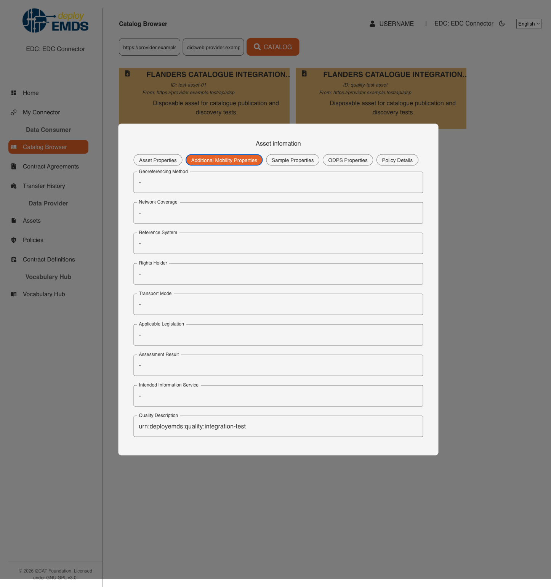

## [3.1.1.1] Data product survey: Discover - Consult data space catalogue

### Stack: protoEMDS Final Stack (EDC-based)

### Statement of assessment

#### Environment

This section identifies the technical context in which the protoEMDS Final Stack assessment is performed.

| Field | Value |
| --- | --- |
| Assessment context | Integration phase assessment of the EMDS final technical infrastructure |
| Result perspective | `protoemds_final_stack` |
| Stack under assessment | protoEMDS Final Stack (EDC-based) |
| KPI1 area | Catalogue discovery / metadata |
| Existing test ID | `3.1.1.1` |
| Level | UC + Technical |
| ISO/IEC 25010 mapping | Functional suitability, Compatibility |
| Owner | Casper (imec, @vghelu49) |
| Reviewer | Carlos |
| Deployment model assessed | CaaS / IONOS-managed deployment |
| Target environment | IONOS-managed CaaS deployment |
| EDC version / release | `emds-edc-connector` `9916cc5`, based on Eclipse EDC `0.10.0` |
| Connector deployment reference | `deployEMDS-k8s-deployment`, branch `prepare-prod`, commit `846e5f1` |
| Assessment evidence | Bruno CLI API execution and authenticated Playwright UI verification; all reported evidence is sanitized |

The assessment should be completed using the deployment model for which evidence is realistically available. It is not mandatory to execute the same test in both CaaS and on-premise environments.

The deployment models are assessed independently. The CaaS assessment is
complete; the on-premise assessment remains `TBD`.

#### Tested quality metric and method

This result reuses the existing stack-agnostic test definition in `test.md` and adds a protoEMDS Final Stack integration-assessment perspective.

It does not replace the historical stack-specific result files, such as `result_edc_vc.md` or `result_fiware.md`.

The quality metric, expected output and comparative criteria remain those defined by the original test. This result file should only capture the evidence and assessment outcome for the selected protoEMDS Final Stack deployment.

#### Test-specific assessment scope

Assessment: If an Online U/X is natively available, evaluate individual search features. If the Data space catalogue exposes an API, assess the technical debt to integrate it with a data search tool that is representative for EU projects. Criteria are: Open Source, hosted solution or EU-driven project.

#### Expected Output

The test aims to determine whether a native online user experience (U/X) is available and evaluate individual search features. 
If the data space catalog exposes an API, the test assesses the technical effort required to integrate it with a data search tool representative of EU projects.
The criteria for evaluation include being open-source, a hosted solution, or part of an EU-driven project.

### Results

#### Assessment

The API and native UI discovery paths passed with limitations.

The consumer Management API returned the newly published dataset with `200 OK`
and the expected dataset metadata and DSP distributions. The authenticated
catalogue browser accepted a counterparty DSP address and DID, returned
multiple products, and displayed product and policy details. No free-text
catalogue search, metadata filters, or pagination controls were available in
the assessed UI. Integration with an external search platform was not executed.

#### Deployment model assessed

| Deployment model | Status | Evidence | Consolidated assessment |
| --- | --- | --- | --- |
| CaaS / IONOS-managed deployment | Assessed | Bruno CLI and Playwright | API and UI catalogue retrieval passed; advanced search and external integration remain limitations. |
| On-premise deployment | TBD | TBD | To be assessed separately. |

#### Measured results

| **Criteria** | Measured KPI | Evidence | Notes |
| --- | ---: | --- | --- |
| **No Coverage:** The solution fails to provide a native online user experience (U/X), exposes no search features, and does not offer any integration with open-source solutions, hosted solutions, or EU-driven projects. | Not selected | API and UI execution | Both API and native UI catalogue retrieval are available. |
| **Minimal Coverage:** The solution meets up to 25% of the evaluation criteria. This might include a basic online user interface with limited functionality, minimal search features, or an API that is available but requires significant technical effort to integrate with any of the three types of solutions: open-source, hosted, or EU-driven projects. | Not selected | API and UI execution | The UI provides product browsing and detailed metadata, exceeding minimal coverage. |
| **Partial Coverage:** The solution satisfies approximately 50% of the evaluation criteria. This could involve a functional online user experience with some search features and an API that supports integration with at least one of the three types of solutions (open-source, hosted, or EU-driven projects) but requires moderate effort. | **2** | API and UI execution | The UI retrieves and displays catalogues and product details, while the DCAT JSON-LD API is usable by external tools. Free-text search, metadata filters, pagination, and a completed external integration were not demonstrated. |
| **Significant Coverage:** The solution covers about 80% of the evaluation criteria. This includes a well-developed online user experience with comprehensive search features, and an API that is well-documented and supports integration with two of the three types of solutions with minimal technical effort. | Not selected | UI inspection | Comprehensive search and two low-effort integrations were not demonstrated. |
| **Full Coverage:** The solution fully meets all evaluation criteria. This includes a fully developed native online user experience with advanced search features, and an API that seamlessly integrates with all three types of solutions (open-source, hosted, and EU-driven projects) with minimal or no technical effort. | Not selected | UI inspection | Advanced search and seamless integration with all three solution types were not demonstrated. |

**Functional Suitability Quality Metric:** 2

The score is 2 because the deployment provides a functional online catalogue
browser and a machine-readable DCAT JSON-LD API, but the assessed UI is a
counterparty catalogue browser rather than an advanced search experience. It
does not expose free-text search, metadata filters, or pagination controls, and
no external search-tool integration was completed during this assessment.

#### Notes

This result introduces a **protoEMDS Final Stack** perspective for the existing test `3.1.1.1` under the KPI1 area **Catalogue discovery / metadata**.

This result should not be interpreted as part of the original Phase 1 / Phase 2 stack-comparison campaign. It is intended as an integration phase assessment of the current EMDS final technical infrastructure.

The score applies to the assessed CaaS deployment. The on-premise result
remains TBD for a separate assessment.
