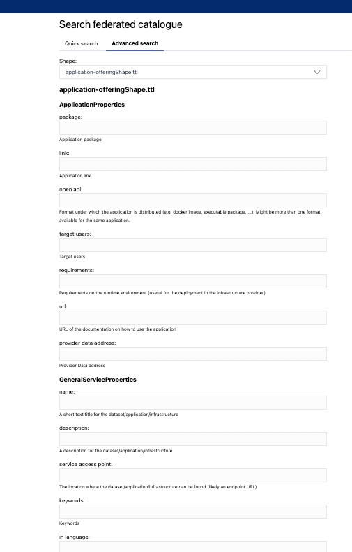

## [3.1.1.1] Data product survey: Discover - Consult data space catalogue
### Stack: SIMPL

## [2.2.3.1D] Data product publication: Publication - Publication on EMDS catalogue
### Stack: SIMPL

### Statement of assessment
#### Environment
The testing environment is an IMEC self-deployed instances of [Simpl-Open](https://code.europa.eu/simpl/simpl-open) on an IONOS Kubernetes cluster, the version used is 1.0.

#### Tested quality metric and method
The quality metric for this test is based on the criteria outlined in [iso27001_kpis_subkpis.xlsx](../../../../../design_decisions/background_info/iso27001_kpis_subkpis.xlsx). In Phase 1, the focus is on the Functional Suitability metric. For detailed information, please refer to the [Comparative criteria (checklists, ...)](./test.md#comparative-criteria-checklists-) section in the test description.

#### Expected output
The test aims to determine whether a native online user experience (U/X) is available and evaluate individual search features. 
If the data space catalog exposes an API, the test assesses the technical effort required to integrate it with a data search tool representative of EU projects.
The criteria for evaluation include being open-source, a hosted solution, or part of an EU-driven project.

### Results
#### Assessment
SIMPL provides a user interface for searching the data space catalog. The search functionality is based on the dataset name and allows for advanced searches based on shapes, etc. 
##### Quick search
The search is based on the data offering name.

##### Advanced search
The advanced search in language, keywords, shapes and other criteria.

###### EU-Driven Project
SIMPL is an EU-driven project aimed at facilitating interoperability among data spaces. Therefore, integrating with the SIMPL catalog involves referencing other data spaces. In the SIMPL Open example, the connector used is EDC, and other connectors are also expected to be interoperable with SIMPL.

#### Measured results
SIMPL offers a native GUI for data offering and catalog searching. However, as it is a minimum viable product, the UI is not tailored at all, lacking delete functionality, session management, etc. The website only supports basic functions. Therefore, the following score has been assigned to the test:
**Functional Suitability Quality Metric: 2**

#### Notes                                                                                             
The current testing version of SIMPL is a very basic Minimum Viable Product solution, version 1.0.     