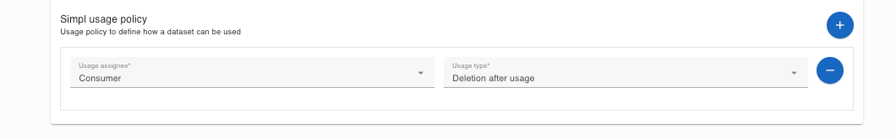

## [5.2.1.1] Data sharing: Data sharing activities - Enforce usage control
### Stack: Simpl

### Statement of assessment
#### Environment

The testing environment is an IMEC self-deployed instances of [Simpl-Open](https://code.europa.eu/simpl/simpl-open) on
an IONOS Kubernetes cluster, the version used is 1.0.

#### Tested quality metric and method

The quality metric for this test is based on the criteria outlined
in [iso27001_kpis_subkpis.xlsx](../../../../../design_decisions/background_info/iso27001_kpis_subkpis.xlsx). In Phase 1,
the focus is on the Functional Suitability metric. For detailed information, please refer to
the [Comparative criteria (checklists, ...)](./test.md#comparative-criteria-checklists-) section in the test
description.

#### Comparative criteria (checklists, ...)
| Criteria           | Scoring          |
| ------------- | ------------- |
| No out of the box policies  | 0 |
| No out of the box policies but policies are available from a library  | 1 |
| Partial out-of-the-box-policies  | 2 |
| Full set of out-of-the-box policies  | 3 |
| Documented way to create/expand policies  | +1 |
| Documented way to create/expand policies + templates for basic polices   | +2 |

#### Expected Output
Usage control is defined based on the IDSA Position Paper “[Data Usage Control in IDS](https://internationaldataspaces.org/data-sovereignty-updated-position-paper-on-data-usage-control-in-the-ids/)”. Usage control involves specifying and enforcing restrictions on what must (or must not) happen to data after access has been granted.

The test aims to evaluate which usage policies are supported out of the box. For those policies not natively supported, it should describe the effort needed to implement them and rank the system accordingly. For instance, creating a plugin within a documented environment is rated more favorably than integrating an external function that introduces dependencies and requires interface maintenance. The essential policies that need to be implemented are:

- **Allow-usage:** Always true or false.
- **Role-restricted:** Based on the role of the participant.
- **Location-restricted:** Based on the location of the consumer, typically "EU" or "Non-EU".

### Results
#### Assessment

[Simpl-Open](https://code.europa.eu/simpl/simpl-open) offers a data offering UI named [SD Tooling Application](https://code.europa.eu/simpl/simpl-open/development/data1/sdtooling-api-be/-/tree/main/documents?ref_type=heads) for creating data offerings.
The application allows users to create usage policies when making self-declarations for data offerings, such as requiring the consumer to delete the data after usage:

Simpl also utilizes the [edc-ionos-s3](https://github.com/Digital-Ecosystems/edc-ionos-s3/tree/main) extension to interact with IONOS S3 storage. 
However, we have not observed the enforcement of usage policies after the transfer process with the current version of [Simpl-Open](https://code.europa.eu/simpl/simpl-open).

#### Measured results

As demonstrated above, Simpl provides a template for users to create a usage policy "deletion after usage", but the enforcement of this policy has not been observed in [Simpl-Open](https://code.europa.eu/simpl/simpl-open). The following score is given to the test:

**Functional Suitability Quality Metric: 1**

#### Notes

The current testing version of Simpl is a very basic Minimum Viable Product solution, version 1.0.   
