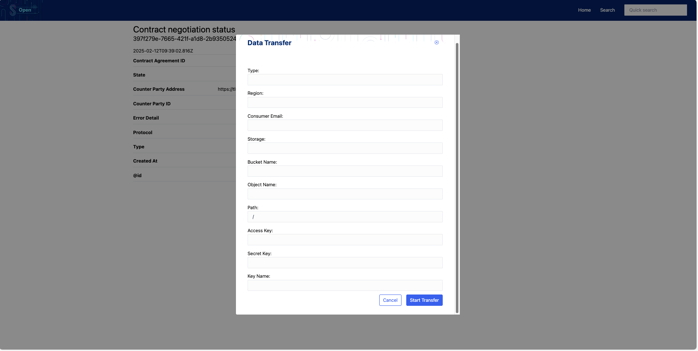

## [5.1.1.1] Data sharing: Data sharing request - Request data transfer
### Stack: Simpl

### Statement of assessment
#### Environment

The testing environment is an IMEC self-deployed instances of [Simpl-Open](https://code.europa.eu/simpl/simpl-open) on
an IONOS Kubernetes cluster, the version used is 1.0.

#### Tested quality metric and method

The quality metric for this test is based on the criteria outlined
in [iso27001_kpis_subkpis.xlsx](../../../../../design_decisions/background_info/iso27001_kpis_subkpis.xlsx). In Phase 1,
the focus is on the Functional Suitability metric. For detailed information, please refer to
the [Comparative criteria (checklists, ...)](./test.md#comparative-criteria-checklists-) section in the test
description.

#### Expected output
The test aims to provide a comprehensive evaluation of the following aspects:

- **Assess the Availability of the API:** Ensure that the API is accessible and functional.
- **Test Data Sharing Requests:** Verify that data sharing requests are correctly processed, covering these steps:
    - Initiating a data sharing request.
    - Retrieving information and status of the data sharing request.
    - Receiving the outcome of the data sharing request, including conditions.
    - Accessing information on past data sharing activities.
The system will score higher if the API is secured and utilizes standard methods, such as REST.

### Results
#### Assessment

[Simpl-Open](https://code.europa.eu/simpl/simpl-open) utilizes the [EDC connector](https://code.europa.eu/simpl/simpl-open/development/gaia-x-edc/simpl-edc) for implementing [Dataspace Protocol](https://docs.internationaldataspaces.org/ids-knowledgebase/dataspace-protocol), including managing data sharing requests. The EDC connector offers management API endpoints for handling data transfer processes, as detailed in [test_5_1_1_1_result_edc_vc.md](result_edc_vc.md).

[Simpl-Open](https://code.europa.eu/simpl/simpl-open) also features a [catalog UI](https://code.europa.eu/simpl/simpl-open/development/gaia-x-edc/simpl-catalogue-client) built on top of the EDC connector, providing a user-friendly interface for managing data sharing requests.

The catalog UI can initiate a contract transfer request, allow users to input their object store location and necessary information, and track the status of the transfer.

However, the catalog UI is quite basic, as Simpl is currently a very basic Minimum Viable Product solution, version 1.0. The UI does not provide any records of past negotiations, and sessions can only be consulted with the specific session ID. Additionally, the UI lacks user account management features, such as URL redirection when logging out and logging back in with a different user role.

#### Measured results

[Simpl-Open](https://code.europa.eu/simpl/simpl-open) utilizes EDC API endpoints to manage data sharing requests and provides a catalog UI for a user-friendly experience. 

However, [Simpl-Open](https://code.europa.eu/simpl/simpl-open) is distributed with a packaged Kubernetes deployment, which makes the API less accessible, and the UI is quite basic and minimalistic as previously mentioned. 
From an API standpoint, the test results are identical to those for EDC. 
However, since the UI features the Simpl project, there is no straightforward way to consult past transfers solely from the Simpl perspective. Therefore, the following scores are assigned to the test:

| Requirement | Measured KPI |
| -|--------------|
| Initiate a data sharing | 4            |
| Retrieve data sharing information and status | 3            |
| Receive data sharing request outcome condition | 3            |
| Retrieve data sharing information of past data sharing actions. | 0            |

**Overall Calculation: (4+3+3+0)/4 = 2.5**

**Functional Suitability Quality Metric Score: 2.5**

#### Notes

The current testing version of Simpl is a very basic Minimum Viable Product solution, version 1.0.   
