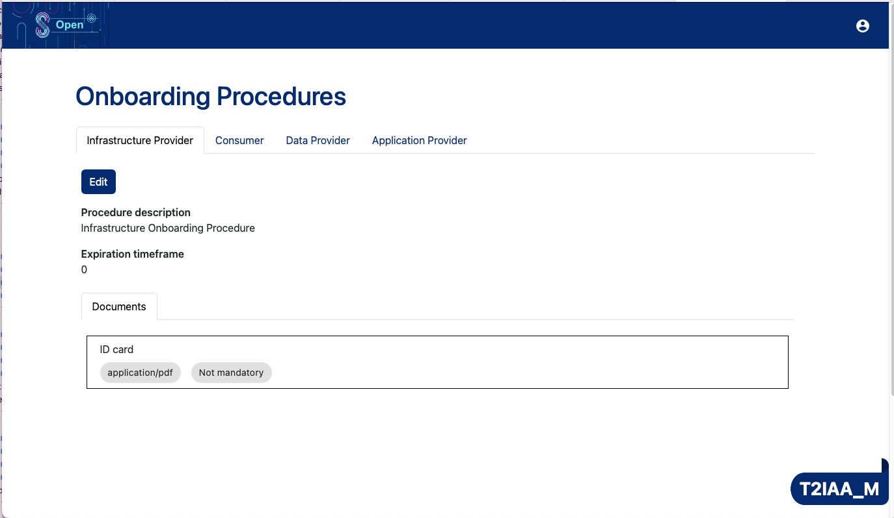
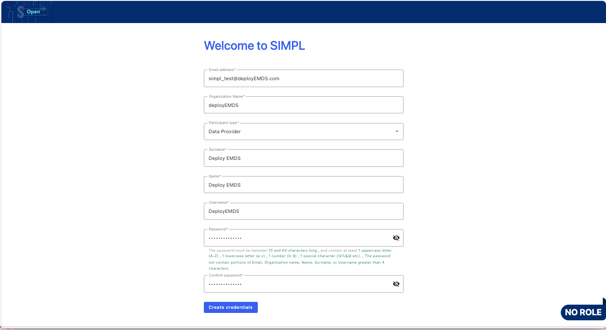
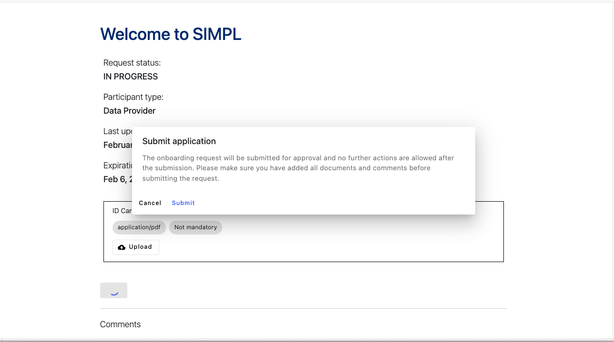
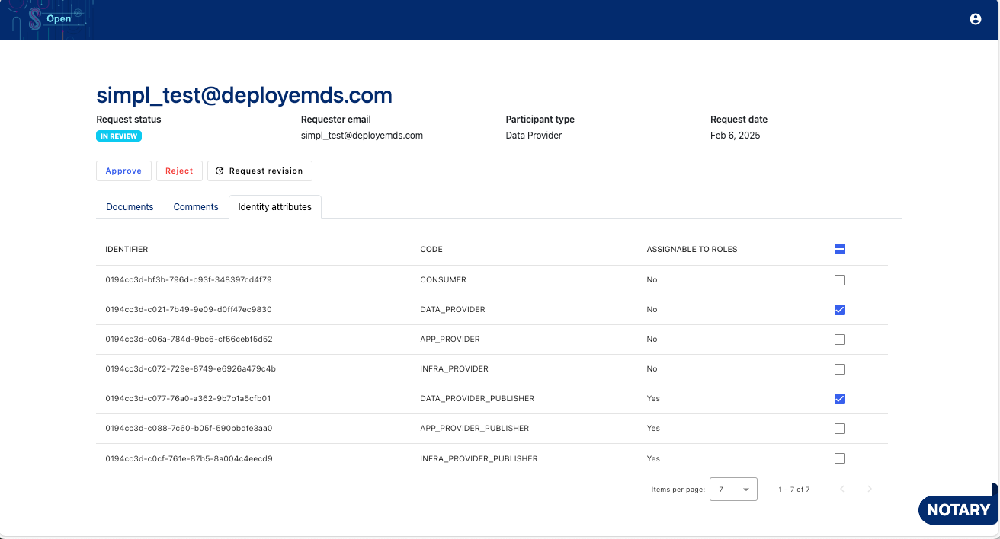
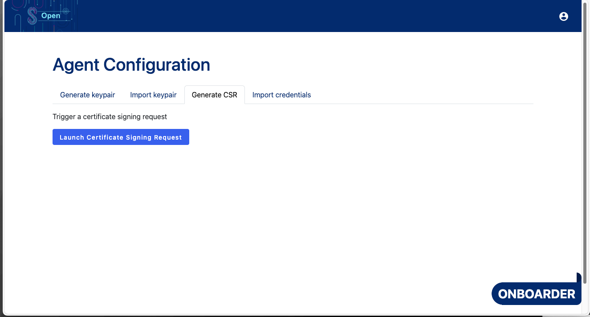
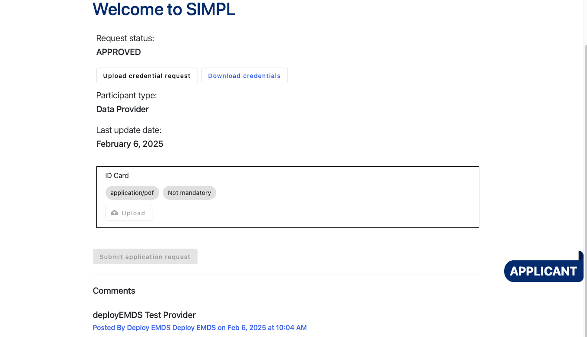
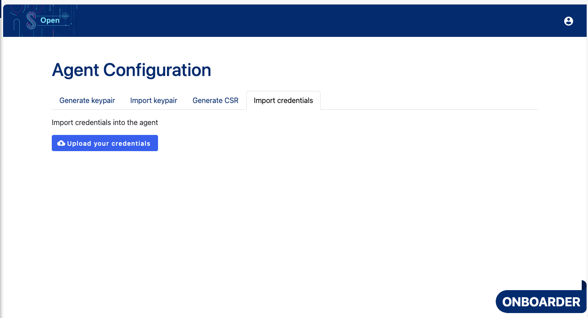

## [1.2.1.1] Participant onboarding: Evaluation - Self-assessment
### Stack: SIMPL

### Statement of assessment
#### Environment
The testing environment is an IMEC self-deployed instances of [Simpl-Open](https://code.europa.eu/simpl/simpl-open) on an IONOS Kubernetes cluster, the version used is 1.0.

#### Tested quality metric and method
The quality metric for this test is based on the criteria outlined in [iso27001_kpis_subkpis.xlsx](../../../../../design_decisions/background_info/iso27001_kpis_subkpis.xlsx). In Phase 1, the focus is on the Functional Suitability metric. For detailed information, please refer to the [Comparative criteria (checklists, ...)](./test.md#comparative-criteria-checklists-) section in the test description.

#### Expected output
**The expected output of this test is to evaluate the level of customization required to input participants' metadata if an onboarding online facility is provided.**

### Results
#### Assessmentn the Data Space.
The onboarding process is an interaction between the new applicant and the authority within the SIMPL context. The procedure involves the following steps:

- **Authority:** The authority responsible for a specific data space must create onboarding procedures for each participant role.

- **Participant:** The participant submits an onboarding request by visiting the onboarding request page, completing the form, and creating their participant profile.**

- **Participant:** Using the newly created participant profile, the participant logs in to the SIMPL authority system to finalize the onboarding application as an applicant.:

- **Authority:** The authority logs in to the frontend as a notary to approve the onboarding application and confirm the selected identity attributes.

- **Authority:** The authority logs in to the frontend as a notary to approve the onboarding application and confirm the selected identity attributes.

- **Participant:** The participant uploads the provided keypair by logging into the authority frontend with the newly created deployEMDS user, submitting the CSR credential request.

Then, the participant downloads the credentials from the authority and imports them into the participant-utility frontend.

Once completed, the participant is successfully onboarded and can interact with other agents within the Data Space.
#### Measured results
The SIMPL solution provides a comprehensive onboarding process that requires minimal customization to input participants' metadata. The onboarding process is well-documented and user-friendly, with clear instructions for both participants and authorities. The process is straightforward and can be completed without significant technical knowledge or customization.

**Is the feature available out-of-the-box in SIMPL (without the need for development)?** Yes
**Given a development effort, is it possible to implement to the fullest extent of the spec?** Yes

Based on the criteria outlined in the [Comparative criteria (checklists, ...)](./test.md#comparative-criteria-checklists-) section of the test description, the test is assigned the following score:

| **Criterion**                | **Description**                                                                          | **Score (0-4)** | **Explanation**                                                                                                      |
|------------------------------|------------------------------------------------------------------------------------------|-----------------|----------------------------------------------------------------------------------------------------------------------|
| **Functional Completeness**   | Technical requirements cover all the specified tasks and user objectives.                | 4               | SIMPL Solution 1.0 provides a user-friendly solution based on CSR for onboarding participants. It is easy to use.    |
| **Functional Correctness**    | Technical requirements meet results with the needed degree of precision.                 | 4               | SIMPL Solution is clear and precise in each step, how the user needs to input its metadata.                          |
| **Functional Appropriateness**| Technical requirements facilitate the accomplishment of specified tasks and objectives.  | 4               | SIMPL Solution is with user-friendly flow, no technical requirement is here once the solution is correctly deployed. |

**Overall Calculation: (4+4+4)/3 = 4**
Functional Suitability Quality Metric Score: 4

#### Notes
