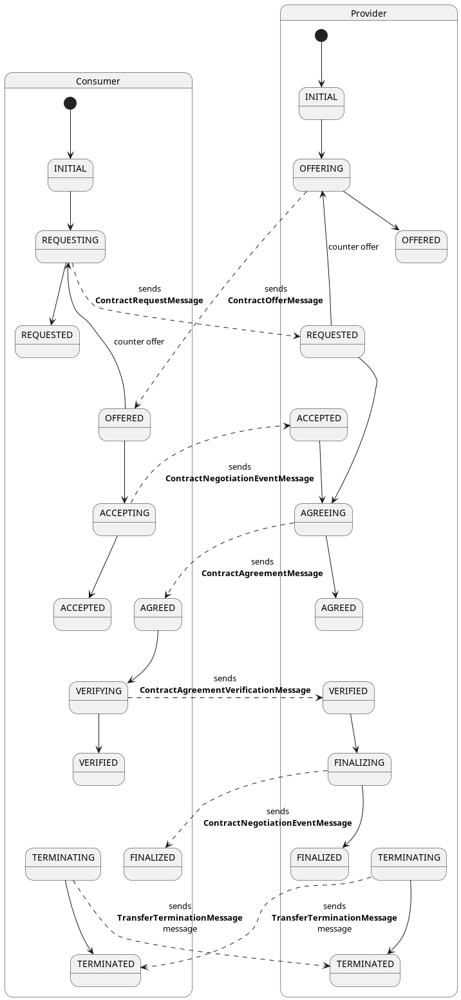

## [4.2.1.1] Sharing agreement: Negotiation - Negotiating sharing agreement
### Stack: EDC+VC

### Statement of assessment
#### Environment
- The test utilizes the EDC MVD commit [5d58b38] (https://github.com/eclipse-edc/MinimumViableDataspace/commit/5d58b3871983ce00a69a38b3215c6a8cb67d8ced).
- The test is executed in an Ubuntu environment using IntelliJ.
#### Tested quality metric and method
The test quality is based on the metric defined in [iso27001_kpis_subkpis.xlsx](../../../../../design_decisions/background_info/iso27001_kpis_subkpis.xlsx)
For current phase (phase 1), the test focus on the Functional suitability quality metric

#### Comparative criteria (checklists, ...)
[TODO] Describe the comparative criteria used for the test / assessment. If possible, align with the criteria used for the same test in the other stack(s).

#### Expected output
The test aims to assess the state machine implementation of the EDC ecosystem regarding the sharing negotiation.

### Results
#### Assessment
The states of contract negotiation are possible with the following states, the states in  **_bold_** are covered by [Data Space Protocol State Machine](https://docs.internationaldataspaces.org/ids-knowledgebase/v/dataspace-protocol/contract-negotiation/contract.negotiation.protocol#id-1.1-states).

- **_REQUESTED: A contract for a Dataset has been requested by the Consumer based on an Offer and the Provider has sent an ACK response._**
- PENDING: A contract negotiation is on hold on one of the parties, might wait for external approvals.
- **_OFFERED: The Provider has sent an Offer to the Consumer and the Consumer has sent an ACK response._** 
- **_ACCEPTED: The Consumer has accepted the latest Offer and the Provider has sent an ACK response._** 
- **_AGREED: The Provider has accepted the latest Offer, sent an Agreement to the Consumer, and the Consumer has sent an ACK response._** 
- **_VERIFIED: The Consumer has sent an Agreement verification to the Provider and the Provider has sent an ACK response._** 
- **_FINALIZED: The Provider has sent a finalization message including his own Agreement verification to the Consumer and the Consumer has sent an ACK response. Data is now available to the Consumer._** 
- **_TERMINATED: The Provider or Consumer has placed the CN in a terminated state. A termination message has been sent by either of the Participants and the other has sent an ACK response. This is a terminal state._** 
- COUNTER_PROPOSAL: The contract negotiation is on hold on the provider side waiting for a COUNTER_PROPOSAL from the consumer party.
- EXPIRED: The negotiation has expired due to a timeout or elapsed deadline without reaching an agreement.
- REVOKED: One of the parties has revoked their offer or request before it could be accepted or rejected.
- CANCELLED: The negotiation has been cancelled by mutual agreement of both parties.

##### EDC implementations 
As there is no TCK (Technology Compatibility Kit) has been published, there is no implementation can "conform" to DSP. However, there is a work in progress and EDC does intend to pass the TCK when it is available. [Refer here](https://github.com/eclipse-edc/Connector/discussions/4351#discussioncomment-10009825).

EDC implements the following states in the [ContractNegotiationStates](https://github.com/eclipse-edc/Connector/blob/f9f4d181cd92514ef1b2d9af96d14ab7ad77757f/spi/control-plane/contract-spi/src/main/java/org/eclipse/edc/connector/controlplane/contract/spi/types/negotiation/ContractNegotiationStates.java#L25)
- INITIAL(50)
- REQUESTING(100)
- REQUESTED(200)
- OFFERING(300)
- OFFERED(400)
- ACCEPTING(700)
- ACCEPTED(800)
- AGREEING(825)
- AGREED(850)
- VERIFYING(1050)
- VERIFIED(1100)
- FINALIZING(1150)
- FINALIZED(1200)
- TERMINATING(1300)
- TERMINATED(1400)

The state machine is [here](https://github.com/eclipse-edc/Connector/blob/main/docs/developer/contracts.md)\


EDC provides a documentation which details the mapping between existing EDC states, the corresponding new EDC states, and the IDS specification states, please refer to [here](https://github.com/eclipse-edc/Connector/blob/main/docs/developer/ids-dataspace-protocol/contract-negotiation-architecture.md#the-state-machine).

The test runs a successful negotiation flow:  for the consumer: initiated → requested → agreed → verified → finalized, for the provider: requested → agreed → verified → finalized.

> - This is for a successful negotiation; if not it will go from the current state to “terminated”
> - Other defined states(e.g. “offered” etc), these are currently not used, but they could be useful if there are other options than just accepting the provider contract as is (currently not implemented in EDC).
> - Policies are evaluated during the  “requested” phase on the provider.
> - During ContractNegotiation, the negotiation has a different id on both provider and consumer

Logs for `ContractNegotiation a1a32534-6c1d-4875-bd48-3b2cc41da8eb` on the `consumer` connector as follows:
```text
DEBUG 2024-07-24T12:35:55.205642506 [ConsumerContractNegotiationManagerImpl] ContractNegotiation a1a32534-6c1d-4875-bd48-3b2cc41da8eb is now in state INITIAL
DEBUG 2024-07-24T12:35:55.470100382 [ConsumerContractNegotiationManagerImpl] ContractNegotiation a1a32534-6c1d-4875-bd48-3b2cc41da8eb is now in state REQUESTING
DEBUG 2024-07-24T12:35:55.470552694 ContractNegotiation: ID a1a32534-6c1d-4875-bd48-3b2cc41da8eb. [Consumer] send request
DEBUG 2024-07-24T12:35:55.816844368 ContractNegotiation: ID a1a32534-6c1d-4875-bd48-3b2cc41da8eb. [Consumer] send request
DEBUG 2024-07-24T12:35:55.816948427 [ConsumerContractNegotiationManagerImpl] ContractNegotiation a1a32534-6c1d-4875-bd48-3b2cc41da8eb is now in state REQUESTED
DEBUG 2024-07-24T12:35:56.503153685 DSP: Incoming ContractAgreementMessage for class org.eclipse.edc.connector.controlplane.contract.spi.types.negotiation.ContractNegotiation process: a1a32534-6c1d-4875-bd48-3b2cc41da8eb
DEBUG 2024-07-24T12:35:56.888602662 [CONSUMER] ContractNegotiation a1a32534-6c1d-4875-bd48-3b2cc41da8eb is now in state AGREED.
DEBUG 2024-07-24T12:35:57.549414156 [ConsumerContractNegotiationManagerImpl] ContractNegotiation a1a32534-6c1d-4875-bd48-3b2cc41da8eb is now in state VERIFYING
DEBUG 2024-07-24T12:35:57.549611466 ContractNegotiation: ID a1a32534-6c1d-4875-bd48-3b2cc41da8eb. [consumer] send verification
DEBUG 2024-07-24T12:35:57.838410104 ContractNegotiation: ID a1a32534-6c1d-4875-bd48-3b2cc41da8eb. [consumer] send verification
DEBUG 2024-07-24T12:35:57.838515447 [ConsumerContractNegotiationManagerImpl] ContractNegotiation a1a32534-6c1d-4875-bd48-3b2cc41da8eb is now in state VERIFIED
DEBUG 2024-07-24T12:35:58.533433993 DSP: Incoming ContractNegotiationEventMessage for class org.eclipse.edc.connector.controlplane.contract.spi.types.negotiation.ContractNegotiation process: a1a32534-6c1d-4875-bd48-3b2cc41da8eb
DEBUG 2024-07-24T12:35:58.72499179 [CONSUMER] ContractNegotiation a1a32534-6c1d-4875-bd48-3b2cc41da8eb is now in state FINALIZED.
```
The corresponding `ContractNegotiation c4dec03e-e21f-4103-b186-6a0e8447d1fb` logs in the `provider` connector are as follows:
```text
DEBUG 2024-07-24T12:35:55.588913773 DSP: Incoming ContractRequestMessage for class org.eclipse.edc.connector.controlplane.contract.spi.types.negotiation.ContractNegotiation process
DEBUG 2024-07-24T12:35:55.75999992 [PROVIDER] ContractNegotiation c4dec03e-e21f-4103-b186-6a0e8447d1fb is now in state REQUESTED.
DEBUG 2024-07-24T12:35:56.30306143 [ProviderContractNegotiationManagerImpl] ContractNegotiation c4dec03e-e21f-4103-b186-6a0e8447d1fb is now in state AGREEING
DEBUG 2024-07-24T12:35:56.303415276 ContractNegotiation: ID c4dec03e-e21f-4103-b186-6a0e8447d1fb. [Provider] send agreement
DEBUG 2024-07-24T12:35:56.890075427 ContractNegotiation: ID c4dec03e-e21f-4103-b186-6a0e8447d1fb. [Provider] send agreement
DEBUG 2024-07-24T12:35:56.890262842 [ProviderContractNegotiationManagerImpl] ContractNegotiation c4dec03e-e21f-4103-b186-6a0e8447d1fb is now in state AGREED
DEBUG 2024-07-24T12:35:57.622123397 DSP: Incoming ContractAgreementVerificationMessage for class org.eclipse.edc.connector.controlplane.contract.spi.types.negotiation.ContractNegotiation process: c4dec03e-e21f-4103-b186-6a0e8447d1fb
DEBUG 2024-07-24T12:35:57.837314656 [PROVIDER] ContractNegotiation c4dec03e-e21f-4103-b186-6a0e8447d1fb is now in state VERIFIED.
DEBUG 2024-07-24T12:35:58.44331619 [ProviderContractNegotiationManagerImpl] ContractNegotiation c4dec03e-e21f-4103-b186-6a0e8447d1fb is now in state FINALIZING
DEBUG 2024-07-24T12:35:58.443776224 ContractNegotiation: ID c4dec03e-e21f-4103-b186-6a0e8447d1fb. [Provider] send finalization
DEBUG 2024-07-24T12:35:58.726042394 ContractNegotiation: ID c4dec03e-e21f-4103-b186-6a0e8447d1fb. [Provider] send finalization
DEBUG 2024-07-24T12:35:58.726205646 [ProviderContractNegotiationManagerImpl] ContractNegotiation c4dec03e-e21f-4103-b186-6a0e8447d1fb is now in state FINALIZED
```
##### Extensibility of EDC implementations
As we can see, EDC supports several states of a contract negotiation, there are still some states not covered, which could be required. e.g. a `PENDING` state. To extend the state flow, few options are available as follows:
- Use [State Transition Functions](https://github.com/eclipse-edc/Connector/blob/main/docs/developer/ids-dataspace-protocol/contract-negotiation-architecture.md)`: State transition functions (StateTransitionFunction) can be registered at specific callback points which are responsible for transitioning the Contract Negotiation State Machine (CNSM) to a new state. These functions can be used to implement custom workflows. In runtime configurations that support it, transition functions will be called transactionally as part of the ContractNegotiationManager process loop. This will ensure state transitions are atomic.
  Scanning through the code taught it’s not yet implemented though [commit 1ce468](https://github.com/eclipse-edc/Connector/commit/1ce4687ac4fe97e676ea04a1518668238b632b34).
- Use [Event Subscriber](https://github.com/eclipse-edc/Connector/blob/1ce4687ac4fe97e676ea04a1518668238b632b34/docs/developer/events.md). Depending on how the EventSubscriber is registered to the EventRouter (synchronous - asynchronous), in synchronous mode, subscriber will block the main thread until the event is dispatched, therefore a 'PENDING' state can be added to the flow in this way.
- etc.. 
#### Measured results
EDC has implemented a state machine and offers an extensible ecosystem; however, these features are not fully available out of the box and may require additional configuration and development.

**Functional suitability quality metric: 4**

#### Notes
EDC is a pluggable ecosystem primarily targeting Java/Kotlin developers. Some extensions are available on the market for plug-and-play, but for certain specific use cases, developers need to write their own extensions.

