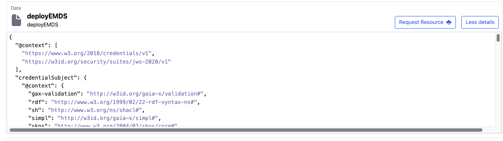
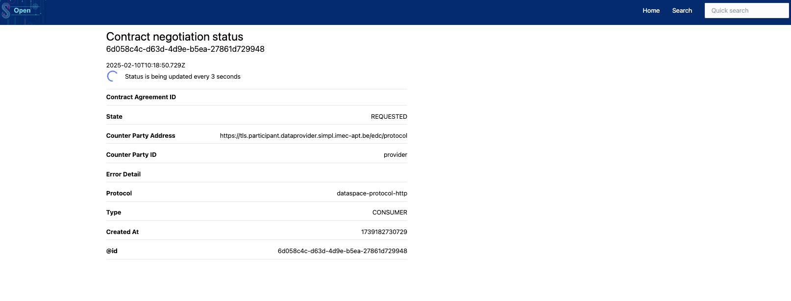

## [4.2.1.1] Sharing agreement: Negotiation - Negotiating sharing agreement
### Stack: SIMPL

### Statement of assessment
#### Environment

The testing environment is an IMEC self-deployed instances of [Simpl-Open](https://code.europa.eu/simpl/simpl-open) on an IONOS Kubernetes cluster, the version used is 1.0.

#### Tested quality metric and method

The quality metric for this test is based on the criteria outlined in [iso27001_kpis_subkpis.xlsx](../../../../../design_decisions/background_info/iso27001_kpis_subkpis.xlsx). In Phase 1, the focus is on the Functional Suitability metric. For detailed information, please refer to the [Comparative criteria (checklists, ...)](./test.md#comparative-criteria-checklists-) section in the test description.

#### Expected output
The test aims to assess the state machine implementation of the SIMPL ecosystem regarding the sharing negotiation.

### Results
#### Assessment
[Simpl-Open](https://code.europa.eu/simpl/simpl-open) uses the EDC connector as its data space connector, thus sharing the same state machine for data sharing contract establishment as described in [result_edc_vc.md](result_edc_vc.md). SIMPL aims to provide interoperability between different data spaces, making its state machine for data sharing contracts based on the data space protocol, which can be considered an EU reference. 
SIMPL provides UI front end for data sharing contract negotiation within catalog UI. When a consumer logs into the catalog UI and locates the desired data offering, the consumer can click the `Request Resource` button to initiate the negotiation process.

Afterward, the catalog UI opens a new window to update the status of the contract negotiation.

#### Measured results

Simpl-Open utilizes the EDC state machine and has implemented a UI interface to enhance the user experience.Therefore, based on the criteria outlined in the [Comparative criteria (checklists, ...)](./test.md#comparative-criteria-checklists-) section of the test description, the test is assigned the following score:

**Functional suitability quality metric: 4**

#### Notes                                                                                             
The current testing version of SIMPL is a very basic Minimum Viable Product solution, version 1.0.   