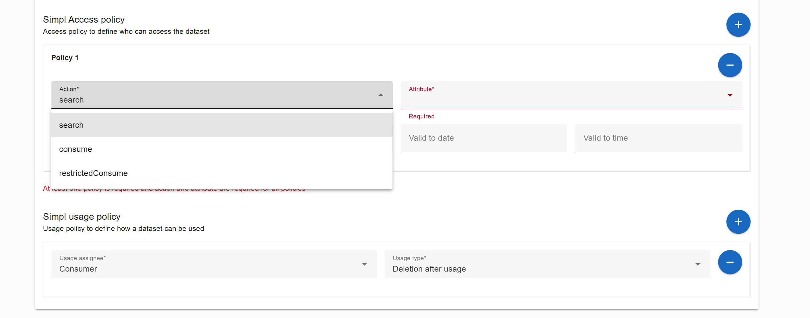

## [4.2.1.3] Sharing agreement: Negotiation - Negotiating sharing agreement
### Stack: SIMPL

### Statement of assessment
#### Environment
The testing environment is an IMEC self-deployed instances of [Simpl-Open](https://code.europa.eu/simpl/simpl-open) on an IONOS Kubernetes cluster, the version used is 1.0.

#### Tested quality metric and method
The quality metric for this test is based on the criteria outlined in [iso27001_kpis_subkpis.xlsx](../../../../../design_decisions/background_info/iso27001_kpis_subkpis.xlsx). In Phase 1, the focus is on the Functional Suitability metric. For detailed information, please refer to the [Comparative criteria (checklists, ...)](./test.md#comparative-criteria-checklists-) section in the test description.

#### Expected output
The test aims to evaluate the coverage of the following criteria on contract negotiation:
- Claim verification
- Usage policy rules
- Service Agreements

### Results
#### Assessment
[Simpl-Open](https://code.europa.eu/simpl/simpl-open) provides [SIMPL agents](https://code.europa.eu/simpl/simpl-open/development/agents) to facilitate the establishment and interoperability of data spaces. 

For data providers, Simpl-Open uses the EDC connector to implement the [Dataspace Protocol](https://docs.internationaldataspaces.org/ids-knowledgebase/dataspace-protocol), including the contract negotiation process and its state machines. 

As explained in the [result_edc_vc.md](result_edc_vc.md), EDC requires extensions implementation to apply specific policy rules.

SIMPL provides predefined access and usage rules via its data provider UI when creating the Self Description of the Service offering, enhancing the user experience on top of the EDC layer.

In the following federated catalog search function, we can see that the access rules are correctly applied. The usage function can be defined, but we did not observe the enforcement of usage policies after the transfer process occurs.

#### Measured results

From the above behavior, we can conclude that SIMPL shares the same result as it uses EDC as backend services for the policy engine of data space contract establishment. In the meantime, SIMPL offers an out-of-the-box solution for defining and enforcing access policies without requiring extra development work.
However, the Service Agreements, specifically [TM Forum Agreement](https://datamodel.tmforum.org/en/latest/EngagedParty/Agreement/), are not supported by SIMPL. Therefore, for this coverage test, the EDC ecosystem can check the first two boxes with an X.

- [X] Claim verification
- [X] Usage policy rules
- [ ] Service Agreements

#### Notes
The current testing version of SIMPL is a very basic Minimum Viable Product solution, version 1.0.   
