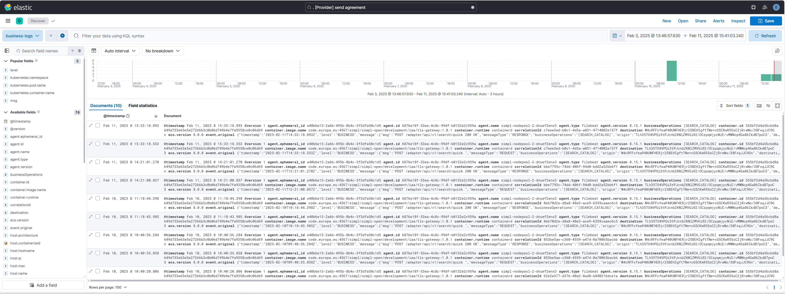

## [4.2.1.7] Sharing agreement: Negotiation - Negotiating sharing agreement
### Stack: SIMPL

### Statement of assessment
#### Environment

The testing environment is an IMEC self-deployed instances of [Simpl-Open](https://code.europa.eu/simpl/simpl-open) on an IONOS Kubernetes cluster, the version used is 1.0.

#### Tested quality metric and method

The quality metric for this test is based on the criteria outlined in [iso27001_kpis_subkpis.xlsx](../../../../../design_decisions/background_info/iso27001_kpis_subkpis.xlsx). In Phase 1, the focus is on the Functional Suitability metric. For detailed information, please refer to the [Comparative criteria (checklists, ...)](./test.md#comparative-criteria-checklists-) section in the test description.

#### Expected output

The test aims to verify that the system generates logs detailing the sharing agreement process. A higher rank will be given if these logs include business information in a standardized format.

### Results
#### Assessment

[Simpl-Open](https://code.europa.eu/simpl/simpl-open) uses the EDC connector for [Dataspace Protocol](https://docs.internationaldataspaces.org/ids-knowledgebase/dataspace-protocol) implementation. 
Consequently, the console logs from the EDC connector are also available within the [Simpl-Open](https://code.europa.eu/simpl/simpl-open) project.
However, since the current deployment primarily consists of microservices on a Kubernetes cluster, maintaining constant visibility on the logs is challenging.
To address this lack of transparency, SIMPL uses Elasticsearch and Kibana to store and visualize the logs. 
The logs are collected by [Filebeat](https://www.elastic.co/blog/kubernetes-observability-tutorial-k8s-log-monitoring-and-analysis-elastic-stack) and sent to Elasticsearch. 
Kibana is used to visualize the logs as explained in the [SIMPL-Open\monitor](https://code.europa.eu/simpl/simpl-open/development/monitoring). 

The default deployed Elasticsearch and Kibana are not properly configured to clearly visualize the logs, and the logs are not filtered correctly. 
This is a configuration task that will be addressed as the project progresses.

#### Measured results

As detailed above, SIMPL builds upon the EDC connection for logging sharing agreement and also uses Elasticsearch to improve transparency when the microservices are deployed in the Kubernetes cluster. Based on the criteria outlined in the [Evaluation Criteria](./test.md#evaluation-criteria) section of the test description, the test is assigned the following score:

**Functional Suitability Quality Metric: 4**

#### Notes

The current testing version of SIMPL is a very basic Minimum Viable Product solution, version 1.0.   
