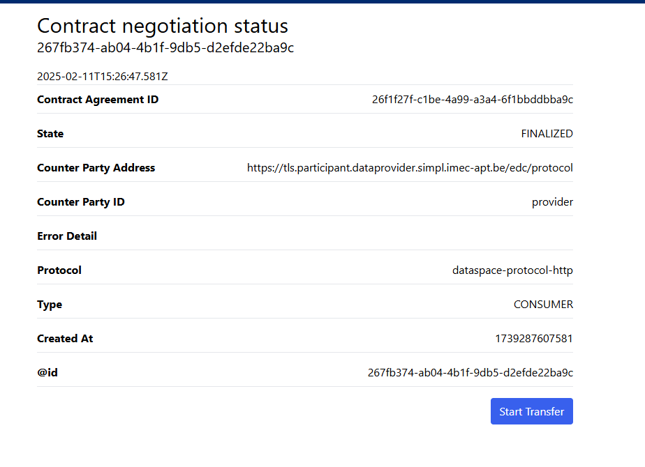
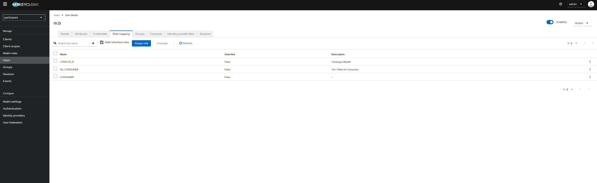

## [4.2.3.1] Sharing agreement: Negotiation - Refusal or registration of sharing agreement
### Stack: Simpl

### Statement of assessment
#### Environment

The testing environment is an IMEC self-deployed instances of [Simpl-Open](https://code.europa.eu/simpl/simpl-open) on
an IONOS Kubernetes cluster, the version used is 1.0.

#### Tested quality metric and method

The quality metric for this test is based on the criteria outlined
in [iso27001_kpis_subkpis.xlsx](../../../../../design_decisions/background_info/iso27001_kpis_subkpis.xlsx). In Phase 1,
the focus is on the Functional Suitability metric. For detailed information, please refer to
the [Comparative criteria (checklists, ...)](./test.md#comparative-criteria-checklists-) section in the test
description.

#### Expected output

The test aims to evaluate whether the negotiation API, status messages, and negotiation logs are accessible only to the
negotiating participants and the system admin. The system admin is a technically privileged role whose identity is not
necessarily that of a participant.

### Results
#### Assessment

In the context of [Simpl-Open](https://code.europa.eu/simpl/simpl-open), participants are the Simpl agents representing
the data space components. Users are the actor role accounts on each participant's side.
Users are managed by the Keycloak instance deployed on each participant's side.
Users with certain privileges can access specific UIs of the participants or have certain UI functions such as search,
create self-description, etc.
Therefore, in the context of [Simpl-Open](https://code.europa.eu/simpl/simpl-open), users are the participants in the
context of the current test.
[Simpl-Open](https://code.europa.eu/simpl/simpl-open) uses the EDC connection for handling [Dataspace Protocol](https://docs.internationaldataspaces.org/ids-knowledgebase/dataspace-protocol), thus it
also includes EDC APIs for contract negotiation, status messages, and logs.
[Simpl-Open](https://code.europa.eu/simpl/simpl-open) also provides a UI to reflect the negotiation status as follows:

The above page is only visible to users with certain roles in the catalog UI. In this case, it is only visible to users with
the `CATALOG_R` role.

#### Measured results

As previously mentioned, [Simpl-Open](https://code.europa.eu/simpl/simpl-open) includes EDC's built-in extensions to
secure API endpoints and restrict logging access. Additionally, Simpl offers role-based user accounts for managing
certain UI access.

Based on the criteria outlined in
the [Comparative criteria (checklists, ...)](./test.md#comparative-criteria-checklists-) section of the test
description, the test is assigned the following score:

**Functional Suitability Quality Metric: 4**

#### Notes

The current testing version of Simpl is a very basic Minimum Viable Product solution, version 1.0.   
