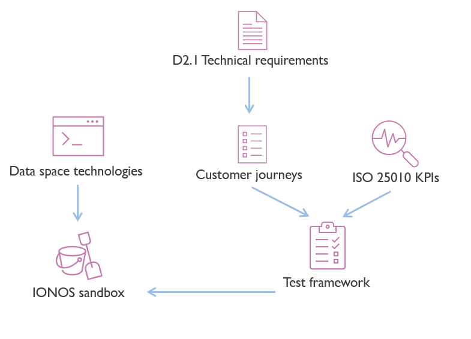

# Way of working

## Repository
The [**deployEMDS** GitHub repository](https://github.com/imec-int/deployEMDS) is the reference container of a thorough assessment of multiple data space technology stacks, more in detail:

* The technical implementations of the `test facilities`_(see infra)_
* The test environment, where reference data sources, data schemas, vocabularies, and usage control policies are shared across all tests.
* The tests and assessments, these are linked to the data space participants' customer journeys covering the essential data space capabilities.

A `test facility` is an environment where a pre-defined technology stack is tested. There might be more test facilities based on the same core technologies but using different capabilities, if this would affect the tests.
For instance: EDC using verifiable credentials, EDC using iShare, Fiware, ...

Each test facility develops tests adapted to the data space's technology. The test definitions are data space stack-agnostic, while the test implementations are specific to the facility. Tests must produce the same expected outcome, but no assumption is made on approaches and technology.

The test results can be found in the `tests/` directory of the repository, and have the following directory structure. This structure was used to implement comparative reviews to align the results of testing facilities.


```.
|-  Business capabilities (i.e. data_product_publication)
|  |-- Customer journeys (i.e. provision)
|  |  |-- Sub-customer journeys (i.e. data_source_endpoint_provisioning)
|  |  |  |--Test number# (i.e. test_2_1_1_1)
|  |  |  |  |-- test.md (the description of the test)
|  |  |  |  |-- test-result-facilityA.md (report on methods and results of the test within a facility, i.e. test-result-edc_vc.md)
|  |  |  |  |-- test-result-facilityB.md (as above, within another facility, i.e. test-result-fiware.md)
|  |  |  |  |-- code-facilityA (For automated or machine-aided tests, i.e. code-edc_vc)
|  |  |  |  |  |-- Any test asset (no assumptions on organization of this folder)
|  |  |  |  |-- code-facilityB (i.e. code-fiware)
|  |  |  |  |-- resources-facilityA (assets, configs, media, DRM material, etc., i.e. resources-edc_vc)
|  |  |  |  |  |-- any other asset needed for testing
|  |  |  |  |-- resources-facility B (i.e. resources-fiware)
```


## Workflow
A **sandbox environment** is provided by IONOS to deploy data space stacks. SaaS providers must make sure that their services are accessible from this environment.

A **data space stack** is the combination of technical building blocks, and it might span over more than one framework (e.g., EDC + iShare). The choice of the stack is delegated to the EMDS Building Block Working Group. The deployment of the stack should result in a mock data space.

The **testing facility** is the composition of infrastructure, data space stack, and test squad (team). We define one stack per test facility, and the mock data space should be consistent for each testing facility. They should have:
- The same participants and their identities.
- The same data product(s) being shared.
- The same usage policies.
- The same data planes.
- The same root taxonomies and vocabularies describing the data product(s).
- The same certificate authority.

The testing facilities will use a phased or agile approach,  where in each phase specific components are deployed and tested.
The progress of each testing facility will be tracked by use of reporting tools, _in casu_ the [GitHub issues](https://github.com/imec-int/deployEMDS/issues) of the GitHub repository.



## Planning
The deployEMDS testing is planned to be executed in three phases:
 1. **Phase 1**: 2024-07-01 - 2024-07-19
 * _[Minimal](https://github.com/imec-int/deployEMDS/issues?q=is%3Aopen+is%3Aissue+milestone%3A%22Phase+1%22+label%3Aminimal)_: The minimal set of tests to be executed in each testing facility.
 * _[Extended](https://github.com/imec-int/deployEMDS/issues?q=is%3Aopen+is%3Aissue+milestone%3A%22Phase+1%22+-label%3Aminimal)_: The extended set of tests to be executed in each testing facility, should time allow.
 2. **Phase 2**: 2024-07-22 - 2024-08-09
 * _Minimal_: The minimal set of tests to be executed in each testing facility.
 * _Extended_: The extended set of tests to be executed in each testing facility, should time allow.

## Testing facilities
The following testing facilities are currently proposed:

| Facility Name     | Stack                                | Components available                                   | Technical buddy                        | Test squad 1 | Test squad 2                  | Status
|-------------------|--------------------------------------|--------------------------------------------------------|----------------------------------------|--------------|-------------------------------|---------------------------------------------------------------------------------------------------------------------------------------------------|
| EDC+VC            | EDC v0.7 with Verifiable Credentials | TBD                                                    |                           | imec         | i2cat (ph 1), NTTDATA (ph 2)  | [Ready to start](https://github.com/imec-int/deployEMDS/issues?q=is%3Aopen+is%3Aissue+milestone%3A%22Phase+1%22+label%3Aedc%2Bvc+label%3Aminimal) |
| Fiware            | Fiware with Verifiable Credentials   | TBD                                                    | Gernot (Fiware)                        | Fraunhofer   | Cefriel                       | [Ready to start](https://github.com/imec-int/deployEMDS/issues?q=is%3Aopen+is%3Aissue+milestone%3A%22Phase+1%22+label%3Afiware+label%3Aminimal+)  |
| Pontus-X | Gaia-X compliant decentralized data economy toolbox | TBD | TBD | TBD | TBD | Interview had, seems interesting (?) |
| ~~EDC+Gaia-X~~        | ~~EDC v0.7 with Gaia-X~~                 | ~~TBD~~                                                    | ~~Jonathan (Eona-X)~~                      | ~~NTTDATA~~      | ~~i2cat (ph 1), imec (ph 2)~~     | ~~Info session completed, not a lot of useful components ready right now~~                                                                                                                             |
| ~~EDC+iShare~~        | ~~EDC v0.7 with iShare~~                 |~~TBD~~                                            | ~~Ferdinand (Fairsfair)~~              | ~~Fraunhofer~~   | ~~NTTDATA~~                     | ~~Not developed~~ yet                                                                                                                                 |
| ~~Fiware+iShare~~ | ~~i4Trust~~  | ~~TBD~~ | ~~Gernot (Fiware)~~                    | ~~imec~~              | ~~Cefriel~~  | ~~Deprecated, will not test~~                                                                                                                     |
| ~~EDC+XFSC~~ | ~~EDC v0.7 with some XFSC components~~ | ~~Catalog, identity provider, wallet from XFSC (Eclipse)~~ | ~~Christoph Lange-Bever (Fraunhofer)~~ | ~~TBD~~ | ~~TBD~~ | ~~Info session completed, difficult deployment and lower maturity~~  |
* **Technical buddies** are either commercial providers or experienced partners who help deploying the stacks.
* The **Test squads** are deployEMDS WP2 workgroup _"Building blocks"_ partners that are responsible for phase 0 and phase 1.